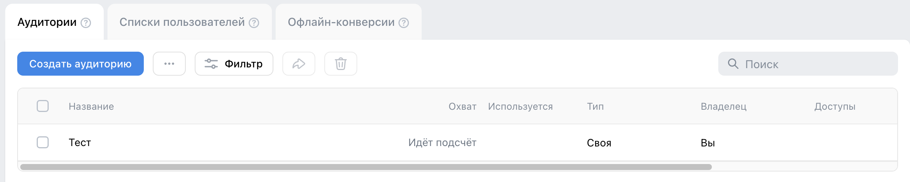
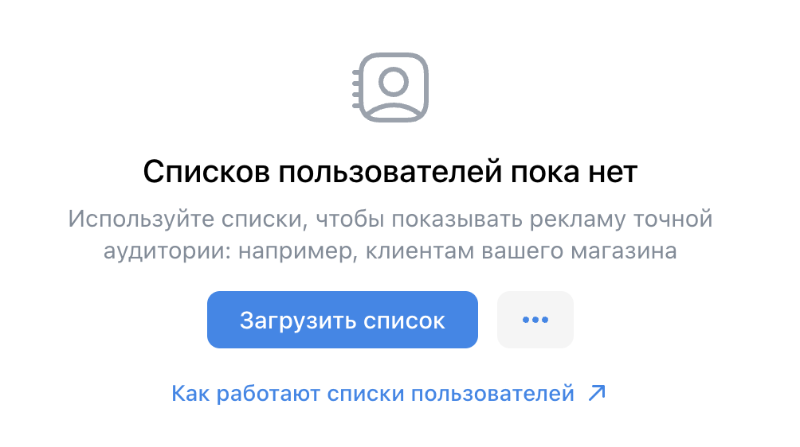
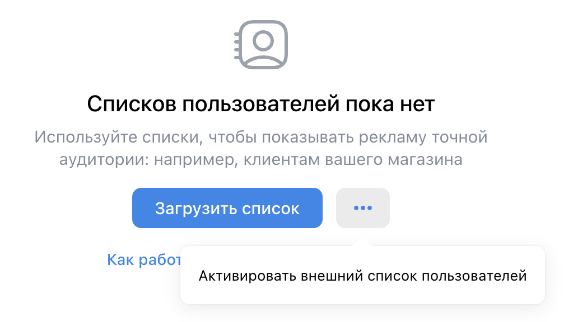
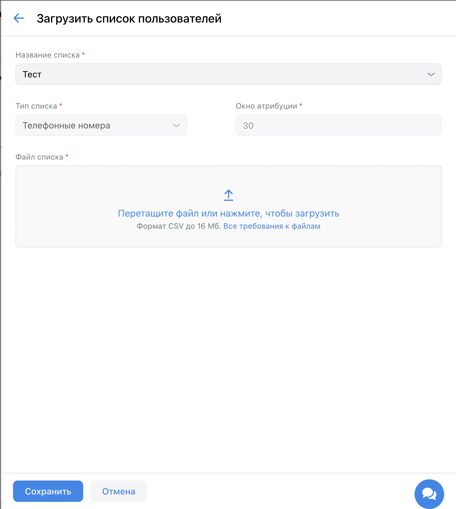
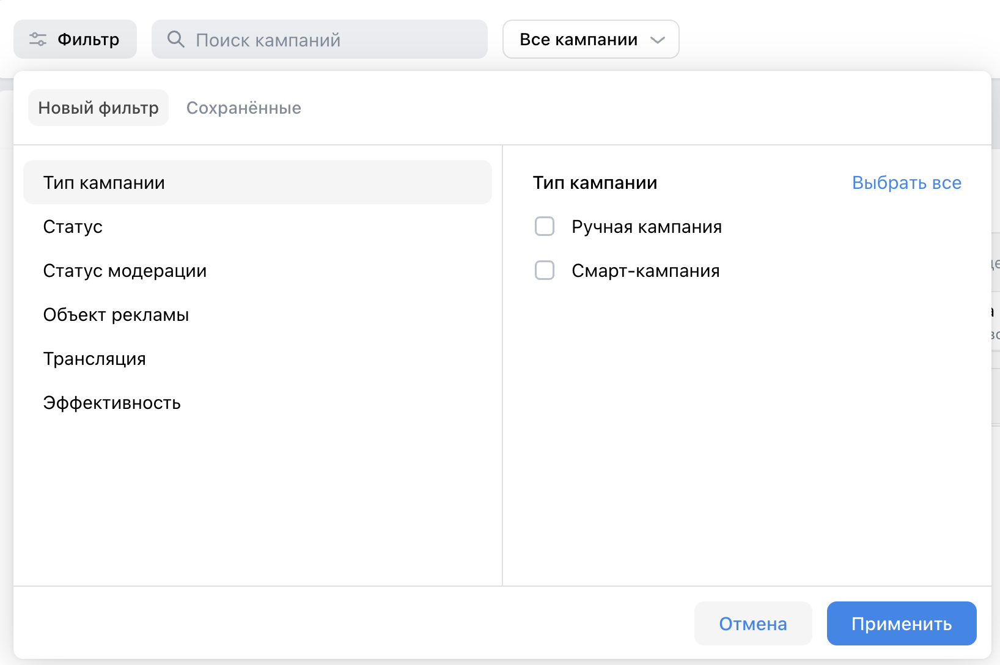
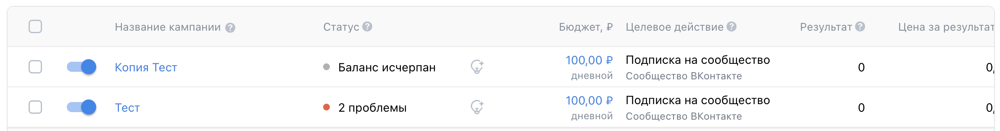
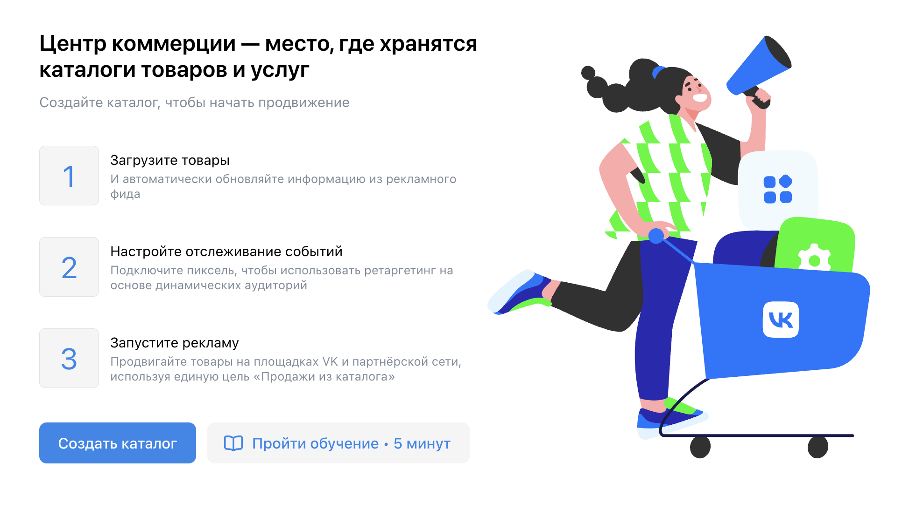

# Домашнее задание 3. Чек-листы на на проект ads.vk.com

## Команда: **SaraFun**

## Содержание

1. [Аудитории](#аудитории)
2. [Рекламные кампании](#рекламные-кампании)
3. [Каталоги](#каталоги)

## Аудитории

Ссылка: [https://ads.vk.com/hq/audience](https://ads.vk.com/hq/audience)

### Основная страница, тест-кейсы когда нет аудиторий

#### Если нет созданных аудиторий, то отображается сообщение "Аудиторий пока нет", кнопка "Создать аудиторию", кнопка меню, ссылка "Как работают аудитории"

1. Перейти на страницу https://ads.vk.com/hq/audience
2. Отображаются элементы: сообщение "Аудиторий пока нет", кнопка "Создать аудиторию", кнопка меню, ссылка "Как работают аудитории"

#### При нажатии на кнопку "Создать аудиторию" открывается окно создания аудитории

1. Перейти на страницу https://ads.vk.com/hq/audience
2. Нажать кнопку "Создать аудиторию"
3. Открывается окно создания аудитории

#### При нажатии на ссылку "Как работают аудитории" открывается новая вкладка со страницей https://ads.vk.com/help/features/audiences_lists/audiences

1. Перейти на страницу https://ads.vk.com/hq/audience
2. Нажать на ссылку "Как работают аудитории"
3. Открывается новая вкладка со страницей https://ads.vk.com/help/features/audiences_lists/audiences

#### При нажатии на кнопку меню открываются пункты меню "Активировать внешнюю аудиторию" и "Перенести аудитории из кабинета ВКонтакте"

1. Перейти на страницу https://ads.vk.com/hq/audience
2. Нажать на кнопку меню
3. Открываются пункты меню "Активировать внешнюю аудиторию" и "Перенести аудитории из кабинета ВКонтакте"

#### При нажатии на пункт меню "Активировать внешнюю аудиторию" открывается окно "Активировать внешнюю аудиторию"

1. Перейти на страницу https://ads.vk.com/hq/audience
2. Нажать на кнопку меню
3. Нажать на пункт меню "Активировать внешнюю аудиторию"
4. Открывается окно "Активировать внешнюю аудиторию"

#### При нажатии на пункт меню "Перенести аудитории из кабинета ВКонтакте" открывается окно "Копирование аудиторий"

1. Перейти на страницу https://ads.vk.com/hq/audience
2. Нажать на кнопку меню
3. Нажать на пункт меню "Перенести аудитории из кабинета ВКонтакте"
4. Открывается окно "Копирование аудиторий"

### Окно создания аудитории

#### При открытии окна создания аудитории оно содержит кнопку с иконкой крестика, кнопку "Добавить источник", кнопку "Исключить источник", кнопку "Сохранить", кнопку "Отмена", поле для ввода названия аудитории, ссылку "Как это работает"

1. Перейти на страницу https://ads.vk.com/hq/audience
2. Нажать кнопку "Создать аудиторию"
3. Открывается окно создания аудитории с соотвествующими элементами: кнопка с иконкой крестика, кнопка "Добавить источник", кнопка "Исключить источник", кнопка "Сохранить", кнопка "Отмена", поле для ввода названия аудитории, ссылка "Как это работает?"

#### Когда не было ничего изменено в окне создания аудитории при нажатии на кнопку с иконкой крестика окно создания аудитории закрывается

1. Перейти на страницу https://ads.vk.com/hq/audience
2. Нажать кнопку "Создать аудиторию"
3. Открывается окно создания аудитории
4. В открывшемся окне нажать кнопку с иконкой крестика
5. Окно создания аудитории закрывается

#### Когда были внесены изменения в окне создания аудитории при нажатии на кнопку с иконкой крестика открывается окно "Прервать создание?"

1. Перейти на страницу https://ads.vk.com/hq/audience
2. Нажать кнопку "Создать аудиторию"
3. Открывается окно создания аудитории
4. В открывшемся окне в поле для введения названия ввести строку "Тест"
5. Нажать кнопку с иконкой крестика
6. Открывается окно "Прервать создание?"

#### В окне создания аудитории при нажатии на ссылку "Как это работает?" открывается новая вкладка со страницей https://ads.vk.com/help/features/audiences_lists/audiences

1. Перейти на страницу https://ads.vk.com/hq/audience
2. Нажать кнопку "Создать аудиторию"
3. Открывается окно создания аудитории
4. В открывшемся окне нажать на ссылку "Как это работает?"
5. Открывается новая вкладка со страницей https://ads.vk.com/help/features/audiences_lists/audiences

#### В окне создания аудитории при нажатии на кнопку "Отмена" окно создания аудитории закрывается

1. Перейти на страницу https://ads.vk.com/hq/audience
2. Нажать кнопку "Создать аудиторию"
3. Открывается окно создания аудитории
4. В открывшемся окне нажать кнопку "Отмена"
5. Окно создания аудитории закрывается

#### В окне создания аудитории при нажатии на кнопку "Добавить источник" открывается окно "Добавить источник"

1. Перейти на страницу https://ads.vk.com/hq/audience
2. Нажать кнопку "Создать аудиторию"
3. Открывается окно создания аудитории
4. В открывшемся окне нажать кнопку "Добавить источник"
5. Открывается окно "Добавить источник"

#### В окне создания аудитории при нажатии на кнопку "Исключить источник" открывается окно "Исключить источник"

1. Перейти на страницу https://ads.vk.com/hq/audience
2. Нажать кнопку "Создать аудиторию"
3. Открывается окно создания аудитории
4. В открывшемся окне нажать кнопку "Исключить источник"
5. Открывается окно "Исключить источник"

#### Когда добавлен хотя бы один источник в меню создания аудитории при нажатии на кнопку редактирования источника открывается окно редактирования выбранного источника

1. Перейти на страницу https://ads.vk.com/hq/audience
2. Нажать кнопку "Создать аудиторию"
3. Открывается окно создания аудитории
5. В открывшемся окне нажать кнопку "Добавить источник"
6. В открывшемся окне "Добавить источник" нажать на пункт "Вводили ключевые фразы"
7. В открывшемся окне "Вводили ключевые фразы" в поле для ввода ключевых фраз написать строку "фраза"
8. В окне "Вводили ключевые фразы" нажать кнопку "Сохранить"
9. В окне "Создать аудиторию" у аудитории "Ключевые фразы" нажать кнопку с иконкой карандаша
10. Открывается окно "Вводили ключевые фразы"

#### Когда добавлен хотя бы один источник в меню создания аудитории при нажатии на кнопку удаления источника открывается окно "Удалить источник?"

1. Перейти на страницу https://ads.vk.com/hq/audience
2. Нажать кнопку "Создать аудиторию"
3. Открывается окно создания аудитории
5. В открывшемся окне нажать кнопку "Добавить источник"
6. В открывшемся окне "Добавить источник" нажать на пункт "Вводили ключевые фразы"
7. В открывшемся окне "Вводили ключевые фразы" в поле для ввода ключевых фраз написать строку "фраза"
8. В окне "Вводили ключевые фразы" нажать кнопку "Сохранить"
9. В окне "Создать аудиторию" у аудитории "Ключевые фразы" нажать кнопку с иконкой мусорки
10. Открывается окно "Удалить источник?"

#### Когда добавлен хотя бы один источник в меню создания аудитории при исключении точно такого же источника появляется сообщение об ошибке

1. Перейти на страницу https://ads.vk.com/hq/audience
2. Нажать кнопку "Создать аудиторию"
3. Открывается окно создания аудитории
5. В открывшемся окне нажать кнопку "Добавить источник"
6. В открывшемся окне "Добавить источник" нажать на пункт "Вводили ключевые фразы"
7. В открывшемся окне "Вводили ключевые фразы" в поле для ввода ключевых фраз написать строку "фраза"
8. В окне "Вводили ключевые фразы" нажать кнопку "Сохранить"
9. В окне "Создать аудиторию" нажать кнопку "Исключить источник"
10. В открывшемся окне "Исключить источник" нажать на пункт "Вводили ключевые фразы"
11. В открывшемся окне "Вводили ключевые фразы" в поле для ввода ключевых фраз написать строку "фраза"
12. В окне "Вводили ключевые фразы" нажать кнопку "Сохранить"
13. В окне создания аудитории в разделе добавленных источников "Ключевые фразы" становится обведено красным цветом и показывается сообщение "Нельзя исключать выбранный источник. Просто удалите его" 

#### При вводе названия аудитории длиной больше 255 символов показывается сообщение об ошибке

1. Перейти на страницу https://ads.vk.com/hq/audience
2. Нажать кнопку "Создать аудиторию"
3. Открывается окно создания аудитории
4. В открывшемся окне в поле ввода названия аудитории ввести строку "1111111111111111111111111111111111111111111111111111111111111111111111111111111111111111111111111111111111111111111111111111111111111111111111111111111111111111111111111111111111111111111111111111111111111111111111111111111111111111111111111111111111111111"
5. Поле ввода меняет цвет на красный и показывается сообщение "Напишите текст не больше 255 символов

#### При заполнении названия длиной менее 256 символов, добавлении хотя бы 1 аудитории или исключении хотя бы 1 аудитории при нажатии на кнопку "Сохранить" аудитория сохраняется

1. Перейти на страницу https://ads.vk.com/hq/audience
2. Нажать кнопку "Создать аудиторию"
3. Открывается окно создания аудитории
4. В открывшемся окне в поле ввода названия написать строку "Тест"
5. В открывшемся окне нажать кнопку "Добавить источник"
6. В открывшемся окне "Добавить аудиторию" нажать на пункт "Вводили ключевые фразы"
7. В открывшемся окне "Вводили ключевые фразы" в поле для ввода ключевых фраз написать строку "фраза"
8. В окне "Вводили ключевые фразы" нажать кнопку "Сохранить"
9. В окне создания аудитории нажать кнопку "Сохранить"
10. Окно создания аудитории закрывается, на вкладке "Аудитории" отображается аудитория с названием "Тест"
11. После теста: нажать на чекбокс у созданной аудитории, нажать на кнопку с иконкой мусорки, в открывшемся окне "Удалить выбранную аудиторию?" нажать кнопку "Удалить"

### Окно добавления источника и окно исключения источника

#### При открытии окна добавления источника оно содержит кнопку с иконкой крестика, кнопку "Сохранить", кнопку "Отмена", разделы "Мои аудитории", "По событиям или реакциям пользователей", "По интересам", ссылку "Как работают источники"

1. Перейти на страницу https://ads.vk.com/hq/audience
2. Нажать кнопку "Создать аудиторию"
3. В открывшемся окне нажать кнопку "Добавить источник"
4. Открывается окно добавления источника, содержащее кнопку с иконкой крестика, кнопку "Сохранить", кнопку "Отмена", разделы "Мои аудитории", "По событиям или реакциям пользователей", "По интересам", ссылку "Как работают источники"

#### При открытии окна исключения источника оно содержит кнопку с иконкой крестика, кнопку "Сохранить", кнопку "Отмена", разделы "Мои аудитории", "По событиям или реакциям пользователей", "По интересам", ссылку "Как работают источники"

1. Перейти на страницу https://ads.vk.com/hq/audience
2. Нажать кнопку "Создать аудиторию"
3. В открывшемся окне нажать кнопку "Исключить источник"
4. Открывается окно исключения источника, содержащее кнопку с иконкой крестика, кнопку "Сохранить", кнопку "Отмена", разделы "Мои аудитории", "По событиям или реакциям пользователей", "По интересам", ссылку "Как работают источники"

#### В окне добавления/исключения источника при нажатии на кнопку с иконкой крестика окно добавления/исключения аудитории закрывается

1. Перейти на страницу https://ads.vk.com/hq/audience
2. Нажать кнопку "Создать аудиторию"
3. В открывшемся окне нажать кнопку "Добавить источник"
4. Нажать кнопку с иконкой крестика
5. Окно добавления источника закрывается, остается открытым окно создания аудитории

#### В окне добавления/исключения источника при нажатии на ссылку "Как работают источники?" открывается новая вкладка со страницей https://ads.vk.com/help/features/audiences_lists/audiences#source

1. Перейти на страницу https://ads.vk.com/hq/audience
2. Нажать кнопку "Создать аудиторию"
3. В открывшемся окне нажать кнопку "Добавить источник"
4. Нажать на ссылку "Как работают источники?"
5. Открывается вкладка со страницей https://ads.vk.com/help/features/audiences_lists/audiences#source

#### В окне добавления/исключения источника при нажатии на кнопку "Отмена" окно добавления/исключения аудитории закрывается

1. Перейти на страницу https://ads.vk.com/hq/audience
2. Нажать кнопку "Создать аудиторию"
3. В открывшемся окне нажать кнопку "Добавить источник"
4. Нажать кнопку "Отмена"
5. Окно добавления источника закрывается, остается открытым окно создания аудитории

#### В окне добавления/исключения источника при наведении на иконку вопросительного знака одного из пунктов появляется подсказка 

1. Перейти на страницу https://ads.vk.com/hq/audience
2. Нажать кнопку "Создать аудиторию"
3. В открывшемся окне нажать кнопку "Добавить источник"
4. Навести на вопросительный знак у источника "Уже созданная аудитория"
5. Появляется подсказка с текстом "Пользователи из уже готовой аудитории"

### Основная страница, тест-кейсы когда есть аудитории

Исходное состояние: имеется созданная аудитория с названием "Тест", источник - Вводили ключевые фразы, фразы: "фраза"

#### Если есть созданные аудитории, то отображается навбар управления аудиториями и список аудиторий

1. Перейти на страницу https://ads.vk.com/hq/audience
2. Отображается навбар с кнопкой "Создать аудиторию", кнопкой с иконкой меню, кнопкой "Фильтр", кнопкой поделиться, кнопкой удалить, строкой поиска; а также отображается список аудиторий с колонками: чекбокс, название, охват, используется, тип, владелец, доступы

### При вводе в строке поиска строки длины менее 3 отображается сообщение "Минимальное количество символов 3"

1. Перейти на страницу https://ads.vk.com/hq/audience
2. Ввести в строку поиска строку "т"
3. Отображается предупреждение с текстом "Минимальное количество символов 3"

### При вводе в строке поиска существующей подстроки длины больше 2 отображается список найденных аудиторий

1. Перейти на страницу https://ads.vk.com/hq/audience
2. Ввести в строку поиска строку "тес"
3. Отображается список аудиторий, состоящий из аудитории с названием "Тест"

### При вводе в строке поиска несуществующей подстроки длины больше 2 отображается сообщение "Ничего не нашлось"

1. Перейти на страницу https://ads.vk.com/hq/audience
2. Ввести в строку поиска строку "тестт"
3. Отображается сообщение "Ничего не нашлось"

#### При клике на название аудитории открывается окно редактирования аудитории

1. Перейти на страницу https://ads.vk.com/hq/audience
2. Нажать на название аудитории "Тест"
3. Открывается окно "Редактирование аудитории"

#### При наведении на аудиторию и наведении на иконку меню показываются пункты меню

1. Перейти на страницу https://ads.vk.com/hq/audience
2. Навести на аудиторию с названием "Тест"
3. Навести на иконку меню
4. Отображаются пункты меню: Редактировать, Настроить доступ, Удалить

#### При выборе пункта меню "Настроить доступ" открывается окно "Настройки доступа к "Название""

1. Перейти на страницу https://ads.vk.com/hq/audience
2. Навести на аудиторию с названием "Тест"
3. Навести на иконку меню
4. Отображаются пункты меню: Редактировать, Настроить доступ, Удалить
5. Нажать на пункт меню "Настроить доступ"
6. Открывается окно "Настройки доступа к "Тест""

#### При нажатии на кнопку "Фильтр" открывается меню пунктов для фильтрации

1. Перейти на страницу https://ads.vk.com/hq/audience
2. Нажать на кнопку "Фильтр"
3. Открывается меню с пунктами для фильтрации

#### При нажатии на "Выбрать все" все пункты меню фильтрации помечаются галочками в чекбоксах

1. Перейти на страницу https://ads.vk.com/hq/audience
2. Нажать на кнопку "Фильтр"
3. Нажать на кнопку "Выбрать все"
4. Все пункты меню отмечены галочками в чекбоксах

#### При нажатии на "Сбросить" у всех пунктов меню фильтрации убираются галочки в чекбоксах

1. Перейти на страницу https://ads.vk.com/hq/audience
2. Нажать на кнопку "Фильтр"
3. Нажать на чекбокс пункта "Уже созданная аудитория"
4. Нажать на кнопку "Сбросить все"
5. Все пункты меню не отмечены галочками в чекбоксах

#### При выборе фильтра при наличии подходящих аудиторий показывается отфильтрованный список аудиторий

1. Перейти на страницу https://ads.vk.com/hq/audience
2. Нажать на кнопку "Фильтр"
3. Выбрать пункт "Вводили ключевые фразы"
4. Нажать кнопку "Применить"
5. Показывается список аудиторий, состоящий из аудитории с названием "Тест"

#### Когда выбраны фильтры при нажатии на кнопку очистить показывается список всех аудиторий

1. Перейти на страницу https://ads.vk.com/hq/audience
2. Нажать на кнопку "Фильтр"
3. Выбрать пункт "События на сайте"
4. Нажать кнопку "Применить"
5. Показывается сообщение "Ничего не нашлось"
6. Нажать на кнопку "Очистить"
7. Показывается список аудиторий, состоящий из аудитории с названием "Тест"

#### Когда выбраны фильтры при нажатии на кнопку с иконкой крестика рядом с выбранным фильтром он убирается и показывается заново отфильтрованный список аудиторий

1. Перейти на страницу https://ads.vk.com/hq/audience
2. Нажать на кнопку "Фильтр"
3. Выбрать пункт "События на сайте", "Вводили ключевые фразы"
4. Нажать кнопку "Применить"
5. Показывается список аудиторий, состоящий из аудитории с названием "Тест"
6. Нажать на кнопку с иконкой крестика для фильтра "Вводили ключевые фразы"
7. Показывается сообщение "Ничего не нашлось"

#### При выборе фильтра при отсутствии подходящих аудиторий показывается сообщение "Ничего не нашлось"

1. Перейти на страницу https://ads.vk.com/hq/audience
2. Нажать на кнопку "Фильтр"
3. Выбрать пункт "События на сайте"
4. Нажать кнопку "Применить"
5. Показывается сообщение "Ничего не нашлось"

#### При выборе аудитории и нажатии на кнопку поделиться открывается окно "Поделиться"

1. Перейти на страницу https://ads.vk.com/hq/audience
2. Нажать галочку в чекбоксе аудитории с названием "Тест"
3. Нажать на кнопку поделиться
4. Открывается окно "Поделиться"

#### В окне "Поделиться" при выборе пункта "Публичный ключ" и нажатии на кнопку "Сохранить" открывается окно "Доступ открыт" со ссылкой 

1. Перейти на страницу https://ads.vk.com/hq/audience
2. Нажать галочку в чекбоксе аудитории с названием "Тест"
3. Нажать на кнопку поделиться
4. Открывается окно "Поделиться"
5. Выбрать пункт "Публичный ключ"
6. Нажать кнопку "Сохранить"
7. Открывается окно "Доступ открыт" со ссылкой для копирования

#### В окне "Доступ открыт" при копировании ссылки появляется уведомление "Ссылка скопирована в буфер обмена"

1. Перейти на страницу https://ads.vk.com/hq/audience
2. Нажать галочку в чекбоксе аудитории с названием "Тест"
3. Нажать на кнопку поделиться
4. Открывается окно "Поделиться"
5. Выбрать пункт "Публичный ключ"
6. Нажать кнопку "Сохранить"
7. Открывается окно "Доступ открыт" со ссылкой для копирования
8. Нажать на кнопку скопировать
9. В нижнем левом углу экрана появляется уведомление с сообщением "Ссылка скопирована в буфер обмена"

#### В окне "Поделиться" при выборе пункта "Приватный ключ", пустой строке в поле ID кабинета и нажатии на кнопку "Сохранить" показывается сообщение "Нужно заполнить"

1. Перейти на страницу https://ads.vk.com/hq/audience
2. Нажать галочку в чекбоксе аудитории с названием "Тест"
3. Нажать на кнопку поделиться
4. Открывается окно "Поделиться"
5. Выбрать пункт "Приватный ключ"
6. Нажать кнопку "Сохранить"
7. Под полем для ввода ID кабинета показывается сообщение "Нужно заполнить"

#### В окне "Поделиться" при выборе пункта "Приватный ключ", при вводе несуществующего ID в поле "ID кабинета" и нажатии на кнопку "Сохранить" показывается сообщение "Пользователь не найден"

1. Перейти на страницу https://ads.vk.com/hq/audience
2. Нажать галочку в чекбоксе аудитории с названием "Тест"
3. Нажать на кнопку поделиться
4. Открывается окно "Поделиться"
5. Выбрать пункт "Приватный ключ"
6. В поле для ввода ID Кабинета ввести строку "123"
7. Нажать кнопку "Сохранить"
8. Под полем для ввода ID кабинета показывается сообщение "Пользователь 123 не найден"

#### В окне "Поделиться" при выборе пункта "Приватный ключ", при вводе существующего ID в поле "ID кабинета" и нажатии на кнопку "Сохранить" открывается окно "Доступ открыт"

1. Перейти на страницу https://ads.vk.com/hq/audience
2. Нажать галочку в чекбоксе аудитории с названием "Тест"
3. Нажать на кнопку поделиться
4. Открывается окно "Поделиться"
5. Выбрать пункт "Приватный ключ"
6. В поле для ввода ID Кабинета ввести строку "1111111"
7. Нажать кнопку "Сохранить"
8. Открывается окно "Доступ открыт" со ссылкой для копирования

#### При выборе аудитории и нажатии на кнопку удалить открывается окно "Удалить выбранную аудиторию?"

1. Перейти на страницу https://ads.vk.com/hq/audience
2. Нажать галочку в чекбоксе аудитории с названием "Тест"
3. Нажать на кнопку удалить с иконкой мусорки
4. Открывается окно "Удалить выбранную аудиторию?"

#### В окне "Удалить выбранную аудиторию?" при нажатии на кнопку удалить аудитория удаляется из списка аудиторий

1. Перейти на страницу https://ads.vk.com/hq/audience
2. Нажать галочку в чекбоксе аудитории с названием "Тест"
3. Нажать на кнопку удалить с иконкой мусорки
4. Открывается окно "Удалить выбранную аудиторию?"
5. Нажать кнопку "Удалить"
6. Окно закрывается, на влкадке "Аудитории" отображается сообщение "Аудиторий пока нет"

### Списки пользователей

Ссылка: https://ads.vk.com/hq/audience/user_lists

#### Если нет созданных списков пользователей, то отображается сообщение "Списков пользователей пока нет", кнопка "Загрузить список", кнопка меню, ссылка "Как работают списки пользователей"

1. Перейти на страницу https://ads.vk.com/hq/audience/user_lists
2. Отображаются элементы: сообщение "Списков пользователей пока нет", кнопка "Загрузить список", кнопка меню, ссылка "Как работают списки пользователей"

#### При нажатии на ссылку "Как работают списки пользователей" открывается новая вкладка со страницей https://ads.vk.com/help/features/audiences_lists/user_lists

1. Перейти на страницу https://ads.vk.com/hq/audience/user_lists
2. Нажать на ссылку "Как работают списки пользователей"
3. Открывается новая вкладка со страницей https://ads.vk.com/help/features/audiences_lists/user_lists

#### При нажатии на кнопку меню показывается пункт меню "Активировать внешний список пользователей"

1. Перейти на страницу https://ads.vk.com/hq/audience/user_lists
2. Нажать на кнопку меню
3. Показывается пункт меню "Активировать внешний список пользователей"

#### При нажатии на пункт меню "Активировать внешний список пользователей" открывается окно "Активировать список пользователей"

1. Перейти на страницу https://ads.vk.com/hq/audience/user_lists
2. Нажать на кнопку меню
3. Нажать на пункт меню "Активировать внешний список пользователей"
4. Открывается окно "Активировать список пользователей"

#### При нажатии на кнопку "Загрузить список" открывается окно загрузки списка

1. Перейти на страницу https://ads.vk.com/hq/audience/user_lists
2. Нажать кнопку "Загрузить список"
3. Открывается окно загрузки списка

#### При вводе пустой строки в название списка появляется сообщение "Нужно заполнить"

1. Перейти на страницу https://ads.vk.com/hq/audience/user_lists
2. Нажать кнопку "Загрузить список"
3. Открывается окно загрузки списка
4. Вписать в поле ввода названия пустую строку
5. Поле ввода названия обведено красным цветом и под ним показывается сообщение "Нужно заполнить"

#### При вводе строки длины больше 255 в название списка появляется сообщение "Превышена длина названия списка"

1. Перейти на страницу https://ads.vk.com/hq/audience/user_lists
2. Нажать кнопку "Загрузить список"
3. Открывается окно загрузки списка
4. Вписать в поле ввода названия строку "1111111111111111111111111111111111111111111111111111111111111111111111111111111111111111111111111111111111111111111111111111111111111111111111111111111111111111111111111111111111111111111111111111111111111111111111111111111111111111111111111111111111111111"
5. Поле ввода названия обведено красным цветом и под ним показывается сообщение "Превышена длина названия списка"

#### При клике на чекбокс "Как имя файла" поле для ввода названия списка становится некликабельным

1. Перейти на страницу https://ads.vk.com/hq/audience/user_lists
2. Нажать кнопку "Загрузить список"
3. Открывается окно загрузки списка
4. Нажать на чекбокс "Как имя файла"
5. Поле ввода названия становится некликабельным

#### При загрузке неверного типа файла и нажатии на кнопку "Сохранить" появляется окно с отображением ошибки

1. Перейти на страницу https://ads.vk.com/hq/audience/user_lists
2. Нажать кнопку "Загрузить список"
3. Открывается окно загрузки списка
4. Выбрать тип списка "Единый список"
5. Нажать на загрузить файл
6. Загрузить файл test.txt
7. Нажать кнопку сохранить
8. Отображается окно "Не удалось загрузить файл"

#### При создании нового списка пользователей, задании имени длиной от 1 до 255, загрузке корректного файла и выборе типа списка, при нажатии на кнопку сохранить созданный список сохраняется

1. Перейти на страницу https://ads.vk.com/hq/audience/user_lists
2. Нажать кнопку "Загрузить список"
3. Открывается окно загрузки списка
4. В поле ввода названия вписать строку "Тест"
5. Выбрать тип списка "ID ВКонтакте"
6. Нажать на загрузить файл
7. Загрузить файл test2.txt
8. Убрать галочку с чек бокса создания аудитории
9. Нажать кнопку сохранить
10. Закрывается окно создания списка пользователей, созданный список "Тест" отображается в списке созданных списков пользователей
11. Удалить созданный список пользователей с помощью наведения на список, нажатия на иконку меню, выбора пункта меню "Удалить"

#### При наведении на созданный список пользователей при нажатии на кнопку меню отображаются пункты меню

Требуется созданный список пользователей с названием "Тест", с загруженным файлом test2.txt, с выбранным типом списка "ID ВКонтакте", не участвующий в кампаниях

1. Навести на список пользователей с названием "Тест"
2. Нажать на кнопку меню
3. Отображаются пункты меню "Удалить", "Настроить доступ"

#### При нажатии на пункт меню "Удалить" если список пользователей нигде не используется список пользователей пропадает из списка

Требуется созданный список пользователей с названием "Тест", с загруженным файлом test2.txt, с выбранным типом списка "ID ВКонтакте", не участвующий в кампаниях

1. Навести на список пользователей с названием "Тест"
2. Нажать на кнопку меню
3. Нажать кнопку "Удалить"
4. Выбранный список убирается и показывается сообщение "Списков пользователей пока нет"

#### При нажатии на пункт меню "Настроить доступ" открывается окно настройки доступа

Требуется созданный список пользователей с названием "Тест", с загруженным файлом test2.txt, с выбранным типом списка "ID ВКонтакте", не участвующий в кампаниях

1. Навести на список пользователей с названием "Тест"
2. Нажать на кнопку меню
3. Нажать кнопку "Настроить доступ"
4. Открывается окно "Настройки доступа к "Тест""

#### При создании нового списка пользователей, задании имени длиной от 1 до 255, загрузке корректного файла, выборе типа списка, галочке на чекбоксе создания аудитории при нажатии на кнопку сохранить созданный список сохраняется и создается соответствующая аудитория

1. Перейти на страницу https://ads.vk.com/hq/audience/user_lists
2. Нажать кнопку "Загрузить список"
3. Открывается окно загрузки списка
4. В поле ввода названия вписать строку "Тест"
5. Выбрать тип списка "ID ВКонтакте"
6. Нажать на загрузить файл
7. Загрузить файл test2.txt
8. Поставить галочку на чек бокс создания аудитории
9. Нажать кнопку сохранить
10. Закрывается окно создания списка пользователей, созданный список "Тест" отображается в списке созданных списков пользователей, на вкладке аудитории отображается аудитория с названием "[auto] Список пользователей / Тест"
11. После теста удалить созданную аудиторию, удалить созданный список пользователей с помощью наведения на список, нажатия на иконку меню, выбора пункта меню "Удалить"

#### При нажатии на пункт меню "Удалить" если список пользователей используется в кампании открывается окно с сообщением "Нельзя удалить список"

Требуется созданный список пользователей с названием "Тест", с загруженным файлом test2.txt, с выбранным типом списка "ID ВКонтакте", участвующий в кампаниях

1. Навести на список пользователей с названием "Тест"
2. Нажать на кнопку меню
3. Нажать кнопку "Удалить"
4. Открывается окно с сообщением "Нельзя удалить список"

### Офлайн-конверсии

Ссылка: https://ads.vk.com/hq/audience/offline_conversion

#### Если нет созданных офлайн-конверсий, то отображается сообщение "Списков офлайн-конверсий пока нет", кнопка "Загрузить список", ссылка "Как работают списки офлайн-конверсий"

1. Перейти на страницу https://ads.vk.com/hq/audience/offline_conversion
2. Отображаются элементы: сообщение "Списков пользователей пока нет", кнопка "Загрузить список", кнопка меню, ссылка "Как работают списки пользователей"

#### При нажатии на ссылку "Как работают списки офлайн-конверсий" открывается новая вкладка со страницей https://ads.vk.com/help/general/sites/crm_offline_conversions#start

1. Перейти на страницу https://ads.vk.com/hq/audience/offline_conversion
2. Нажать на ссылку "Как работают списки офлайн-конверсий"
3. Открывается новая вкладка со страницей https://ads.vk.com/help/general/sites/crm_offline_conversions#start

#### При нажатии на кнопку "Загрузить список" открывается окно загрузки списка

1. Перейти на страницу https://ads.vk.com/hq/audience/offline_conversion
2. Нажать кнопку "Загрузить список"
3. Открывается окно "Загрузить список пользователей"

#### В окне загрузки списка при выборе "Создать новый" открывается расширенное окно загрузки списка

1. Перейти на страницу https://ads.vk.com/hq/audience/offline_conversion
2. Нажать кнопку "Загрузить список"
3. Открывается окно "Загрузить список пользователей"
4. Нажать кнопку "Создать новый"
5. Открывается расширенное окно загрузки списка с полями "Название", "Тип списка", "Окно атрибуции", чекбокс "Как имя файла", "Файл списка"

#### В расширенном окне загрузки списка при вводе пустой строки в поле ввода названия и попытке сохранения показывается сообщение "Заполните это поле"

1. Перейти на страницу https://ads.vk.com/hq/audience/offline_conversion
2. Нажать кнопку "Загрузить список"
3. Открывается окно "Загрузить список пользователей"
4. Нажать кнопку "Создать новый"
5. Открывается расширенное окно загрузки списка
6. Ввести в название пустую строку
7. Нажать кнопку "Сохранить"
8. Поле ввода названия обведено красным и под полем ввода показывается сообщение "Заполните это поле"

#### В расширенном окне загрузки списка при вводе строки длиной более 255 символов в поле ввода названия и попытке сохранения показывается сообщение "Напишите текст не больше 255 символов"

1. Перейти на страницу https://ads.vk.com/hq/audience/offline_conversion
2. Нажать кнопку "Загрузить список"
3. Открывается окно "Загрузить список пользователей"
4. Нажать кнопку "Создать новый"
5. Открывается расширенное окно загрузки списка
6. Ввести в название строку "1111111111111111111111111111111111111111111111111111111111111111111111111111111111111111111111111111111111111111111111111111111111111111111111111111111111111111111111111111111111111111111111111111111111111111111111111111111111111111111111111111111111111111"
7. Нажать кнопку "Сохранить"
8. Поле ввода названия обведено красным и под полем ввода показывается сообщение "Напишите текст не больше 255 символов"

#### В расширенном окне загрузки списка когда не выбран тип списка и после нажатия сохранения показывается сообщение "Заполните это поле"

1. Перейти на страницу https://ads.vk.com/hq/audience/offline_conversion
2. Нажать кнопку "Загрузить список"
3. Открывается окно "Загрузить список пользователей"
4. Нажать кнопку "Создать новый"
5. Открывается расширенное окно загрузки списка
6. Оставить тип списка не выбранным
7. Нажать кнопку "Сохранить"
8. Поле выбора типа списка обведено красным и под полем показывается сообщение "Заполните это поле"

#### В расширенном окне загрузки списка при вводе пустой строки в поле ввода "Окно атрибуции" и после нажатия сохранения показывается сообщение "Значение должно быть интервале от 1 до 90 дней"

1. Перейти на страницу https://ads.vk.com/hq/audience/offline_conversion
2. Нажать кнопку "Загрузить список"
3. Открывается окно "Загрузить список пользователей"
4. Нажать кнопку "Создать новый"
5. Открывается расширенное окно загрузки списка
6. Ввести пустую строку в поле ввода "Окно атрибуции"
7. Нажать кнопку "Сохранить"
8. Поле ввода окна атрибуции обведено красным и под полем показывается сообщение "Значение должно быть интервале от 1 до 90 дней"

#### В расширенном окне загрузки списка при вводе числа меньше 1 или больше 90 в поле ввода "Окно атрибуции" и после нажатия сохранения показывается сообщение "Значение должно быть интервале от 1 до 90 дней"

1. Перейти на страницу https://ads.vk.com/hq/audience/offline_conversion
2. Нажать кнопку "Загрузить список"
3. Открывается окно "Загрузить список пользователей"
4. Нажать кнопку "Создать новый"
5. Открывается расширенное окно загрузки списка
6. Ввести в поле ввода "Окно атрибуции" число 91
7. Нажать кнопку "Сохранить"
8. Поле ввода окна атрибуции обведено красным и под полем показывается сообщение "Значение должно быть интервале от 1 до 90 дней"

#### В расширенном окне загрузки списка когда не загружен файл списка и после нажатия сохранения показывается сообщение "Заполните это поле"

1. Перейти на страницу https://ads.vk.com/hq/audience/offline_conversion
2. Нажать кнопку "Загрузить список"
3. Открывается окно "Загрузить список пользователей"
4. Нажать кнопку "Создать новый"
5. Открывается расширенное окно загрузки списка
6. Не добавлять файл списка
7. Нажать кнопку "Сохранить"
8. Под полем добавления файла списка показывается сообщение "Заполните это поле"

#### В расширенном окне загрузки списка при вводе названия длиной от 1 до 255, вводе окна атрибуции от 1 до 90, выбора типа списка, загрузке валидного файла и после нажатия сохранения созданный список сохраняется

1. Перейти на страницу https://ads.vk.com/hq/audience/offline_conversion
2. Нажать кнопку "Загрузить список"
3. Открывается окно "Загрузить список пользователей"
4. Нажать кнопку "Создать новый"
5. Открывается расширенное окно загрузки списка
6. Ввести в поле для ввода названия строку "Тест"
7. Ввести в поле ввода "Окно атрибуции" число 30
8. Выбрать тип списка "Телефонные номера"
9. Загрузить файл test.csv
10. Нажать кнопку "Сохранить"
11. Окно создания списка закрывается, на вкладке офлайн-конверсии отображается список "Тест"
12. Удалить созданный список конверсий с помощью наведения на список, нажатия на иконку меню, выбора пункта меню "Удалить"

#### При наведении на список офлайн-конверсий, нажатии на кнопку меню отображаются пункты "Редактировать", "История изменений"

Требуется предварительно созданный список офлайн-конверсий с названием "Тест", телефонные номера, test.csv

1. Перейти на страницу https://ads.vk.com/hq/audience/offline_conversion
2. Навести на список офлайн-конверсий с названием "Тест"
3. Нажать на иконку меню 
8. Отображаются пункты меню "Редактировать", "История изменений"

#### При нажатии на пункт меню "Редактировать" открывается окно "Загрузить список пользователей"

Требуется предварительно созданный список офлайн-конверсий с названием "Тест", телефонные номера, test.csv

1. Перейти на страницу https://ads.vk.com/hq/audience/offline_conversion
2. Навести на список офлайн-конверсий с названием "Тест"
3. Нажать на иконку меню 
8. Отображаются пункты меню "Редактировать", "История изменений"
9. Нажать на пункт "Редактировать"
10. Открывается окно "Загрузить список пользователей"

#### При нажатии на пункт меню "История изменений" открывается новая вкладка со страницей истории изменений

Требуется предварительно созданный список офлайн-конверсий с названием "Тест", телефонные номера, test.csv

1. Перейти на страницу https://ads.vk.com/hq/audience/offline_conversion
2. Навести на список офлайн-конверсий с названием "Тест"
3. Нажать на иконку меню 
8. Отображаются пункты меню "Редактировать", "История изменений"
9. Нажать на пункт "История изменений"
10. Открывается новая вкладка со страницей https://ads.vk.com/hq/settings/logs?object=210237&type=user_offline_url, которая содержит раздел "История изменений", фильтр "Тип объекта: Список офлайн-конверсий",

## Рекламные кампании

Ссылка: [https://ads.vk.com/hq/dashboard](https://ads.vk.com/hq/dashboard)

#### Если нет созданных рекламных кампаний, то отображается сообщение "Создайте первую рекламную кампанию", кнопка "Создать кампанию"

1. Перейти на страницу https://ads.vk.com/hq/dashboard
2. Отображаются элементы: сообщение "Создайте первую рекламную кампанию", кнопка "Создать кампанию"

#### При нажатии на кнопку "Создать кампанию" открывается страница создания рекламной кампании

1. Перейти на страницу https://ads.vk.com/hq/dashboard
2. Нажать на кнопку "Создать"
3. Открывается страница https://ads.vk.com/hq/new_create/ad_plan

#### На этапе создания рекламной кампании "Настройка кампании" при попытке ввести название длины меньше 3 кнопка галочки становится некликабельной и название не сохраняется

1. Перейти на страницу https://ads.vk.com/hq/dashboard
2. Нажать на кнопку "Создать"
3. Открывается страница https://ads.vk.com/hq/new_create/ad_plan
4. Нажать кнопку с иконкой крандаша рядом с названием
5. В поле ввода ввести строку "те"
6. Галочка для сохранения некликабельная и горит серым цветом

#### На этапе создания рекламной кампании "Настройка кампании" при попытке ввести название длины больше 255 введенная строка обрезается до длины 255

1. Перейти на страницу https://ads.vk.com/hq/dashboard
2. Нажать на кнопку "Создать"
3. Открывается страница https://ads.vk.com/hq/new_create/ad_plan
4. Нажать кнопку с иконкой крандаша рядом с названием
5. В поле ввода ввести строку "1111111111111111111111111111111111111111111111111111111111111111111111111111111111111111111111111111111111111111111111111111111111111111111111111111111111111111111111111111111111111111111111111111111111111111111111111111111111111111111111111111111111111111"
6. Строка обрезается до длины 255

#### На этапе создания рекламной кампании "Настройка кампании" при попытке ввести название длины от 3 до 255 кнопка галочки становится кликабельной и название сохраняется

1. Перейти на страницу https://ads.vk.com/hq/dashboard
2. Нажать на кнопку "Создать"
3. Открывается страница https://ads.vk.com/hq/new_create/ad_plan
4. Нажать кнопку с иконкой крандаша рядом с названием
5. В поле ввода ввести строку "Тест"
6. Галочка для сохранения кликабельная, нажимаем ее
7. Название изменяется на "Тест"

#### На этапе создания рекламной кампании "Настройка кампании" при выборе категории "Сайт" при вводе некорректной ссылки отображается ошибка "Неверный формат URL"

1. Перейти на страницу https://ads.vk.com/hq/dashboard
2. Нажать на кнопку "Создать"
3. Открывается страница https://ads.vk.com/hq/new_create/ad_plan
4. Выбрать подраздел "Сайт" в разделе "Целевые действия"
5. В поле для ввода сайта ввести строку "тест"
6. Поле ввода обведено красным и под ним показывается ошибка "Неверный формат URL"

#### На этапе создания рекламной кампании "Настройка кампании" при выборе категории "Сайт" при вводе корректной ссылки отображаются поля для ввода "Важные детали и отличия от конкурентов", "Целевое действие", "Стратегия ставок", "Бюджет", "Даты проведения"

1. Перейти на страницу https://ads.vk.com/hq/dashboard
2. Нажать на кнопку "Создать"
3. Открывается страница https://ads.vk.com/hq/new_create/ad_plan
4. Выбрать подраздел "Сайт" в разделе "Целевые действия"
5. В поле для ввода сайта ввести строку "https://vk.com/"
6. Показываются дополнительные поля ввода

#### В поле для ввода "Важные детали и отличия от конкурентов" невозможно ввести строку больше 300 символов

1. Перейти на страницу https://ads.vk.com/hq/dashboard
2. Нажать на кнопку "Создать"
3. Открывается страница https://ads.vk.com/hq/new_create/ad_plan
4. Выбрать подраздел "Сайт" в разделе "Целевые действия"
5. В поле для ввода сайта ввести строку "https://vk.com/"
6. В поле для ввода "Важные детали и отличия от конкурентов" ввести строку "1111111111111111111111111111111111111111111111111111111111111111111111111111111111111111111111111111111111111111111111111111111111111111111111111111111111111111111111111111111111111111111111111111111111111111111111111111111111111111111111111111111111111111111111111111111111111111111111111111111111111"
7. Строка обрезается до 300 символов

#### При вводе в поле для ввода "Бюджет" числа меньше 100 и нажатии кнопки "Продолжить" показывается сообщение об ошибке

1. Перейти на страницу https://ads.vk.com/hq/dashboard
2. Нажать на кнопку "Создать"
3. Открывается страница https://ads.vk.com/hq/new_create/ad_plan
4. Выбрать подраздел "Сайт" в разделе "Целевые действия"
5. В поле для ввода сайта ввести строку "https://vk.com/"
6. В поле для ввода "Бюджет" ввести строку "0"
7. Нажать кнопку продолжить
8. Поле ввода обведено красным и под ним показывается сообщение об ошибке "Укажите бюджет не меньше 100₽"

#### При незаполнении обязательных полей помеченных красной * и нажатии кнопки "Продолжить" показывается сообщение об ошибке рядом с кнопкой "Продолжить"

1. Перейти на страницу https://ads.vk.com/hq/dashboard
2. Нажать на кнопку "Создать"
3. Открывается страница https://ads.vk.com/hq/new_create/ad_plan
4. Выбрать подраздел "Сайт" в разделе "Целевые действия"
5. В поле для ввода сайта ввести строку "https://vk.com/"
6. В поле для ввода "Бюджет" ввести пустую строку
7. Нажать кнопку продолжить
8. Поле ввода обведено красным и под ним показывается сообщение об ошибке "Нужно", рядом с кнопкой "Продолжить" отображается плашка "1 ошибка"

#### При незаполнении региона показа на этапе "Группы объявлений" и нажатии кнопки "Продолжить" показывается сообщение об ошибке

1. Перейти на страницу https://ads.vk.com/hq/dashboard
2. Нажать на кнопку "Создать"
3. Открывается страница https://ads.vk.com/hq/new_create/ad_plan
4. Выбрать подраздел "Сайт" в разделе "Целевые действия"
5. В поле для ввода сайта ввести строку "https://vk.com/"
6. В поле для ввода "Бюджет" ввести "100"
7. Открывается второй этап создания кампании "Группы объявлений"
8. Нажать кнопку продолжить
9. Под строкой поиска региона отображается плашка с ошибкой "Выберите регионы показа"

#### При выборе раздела "Сообщество и профиль" при вводе несуществующего сообщества показывается сообщение об ошибке

1. Перейти на страницу https://ads.vk.com/hq/dashboard
2. Нажать на кнопку "Создать"
3. Открывается страница https://ads.vk.com/hq/new_create/ad_plan
4. Выбрать подраздел "Сообщество и профиль" в разделе "Целевые действия"
5. Нажать на выпадающий список "Рекламируемый объект"
6. Выбрать пункт "Другое сообщество"
7. В открывшемся окне для указания ссылки вписать строку "aaawwwwwwwwwww"
8. Нажать кнопку "Добавить"
9. Поле ввода обведено красным и под ним показывается сообщение об ошибке "Сообщество не найдено"

#### При выборе раздела "Сообщество и профиль" при вводе закрытого сообщества показывается сообщение об ошибке

1. Перейти на страницу https://ads.vk.com/hq/dashboard
2. Нажать на кнопку "Создать"
3. Открывается страница https://ads.vk.com/hq/new_create/ad_plan
4. Выбрать подраздел "Сообщество и профиль" в разделе "Целевые действия"
5. Нажать на выпадающий список "Рекламируемый объект"
6. Выбрать пункт "Другое сообщество"
7. В открывшемся окне для указания ссылки вписать строку "healtech_bmstu"
8. Нажать кнопку "Добавить"
9. Поле ввода обведено красным и под ним показывается сообщение об ошибке "Нельзя продвигать закрытое сообщество"

#### При выборе раздела "Сообщество и профиль" при вводе открытого сообщества показывается название сообщества в поле "Рекламируемый объект"

1. Перейти на страницу https://ads.vk.com/hq/dashboard
2. Нажать на кнопку "Создать"
3. Открывается страница https://ads.vk.com/hq/new_create/ad_plan
4. Выбрать подраздел "Сообщество и профиль" в разделе "Целевые действия"
5. Нажать на выпадающий список "Рекламируемый объект"
6. Выбрать пункт "Другое сообщество"
7. В открывшемся окне для указания ссылки вписать строку "son_sovy"
8. Нажать кнопку "Добавить"
9. В поле выпадающего списка "Рекламируемый объект" написано название сообщества "Авторская керамика | Сон Совы"

#### При выборе раздела "Сообщество и профиль" при выборе создать новое сообщество открывается новая вкладка со страницей вконтакте https://vk.com/groups?w=groups_create_new

1. Перейти на страницу https://ads.vk.com/hq/dashboard
2. Нажать на кнопку "Создать"
3. Открывается страница https://ads.vk.com/hq/new_create/ad_plan
4. Выбрать подраздел "Сообщество и профиль" в разделе "Целевые действия"
5. Нажать на выпадающий список "Рекламируемый объект"
6. Выбрать пункт "Создать сообщество"
7. В открывшемся окне нажать кнопку "Перейти"
8. Нажать кнопку "Добавить"
9. Открывается новая вкладка со страницей https://vk.com/groups?w=groups_create_new

#### При выборе раздела "Дзен" при нажатии на кнопку "Перейти в Студию" открывается новая вкладка со страницей https://dzen.ru/profile/editor/id/681f25d369789411e686b300/campaigns

1. Перейти на страницу https://ads.vk.com/hq/dashboard
2. Нажать на кнопку "Создать"
3. Открывается страница https://ads.vk.com/hq/new_create/ad_plan
4. Выбрать подраздел "Дзен" в разделе "Целевые действия"
5. Нажать на кнопку "Перейти в Студию"
9. Открывается новая вкладка со страницей https://dzen.ru/profile/editor/id/681f25d369789411e686b300/campaigns

#### При выборе раздела "Мобильное приложение" при выборе в выпадающем списке пункта "Привязать новое приложение" открывается окно "Привязка приложения"

1. Перейти на страницу https://ads.vk.com/hq/dashboard
2. Нажать на кнопку "Создать"
3. Открывается страница https://ads.vk.com/hq/new_create/ad_plan
4. Выбрать подраздел "Мобильное приложение" в разделе "Целевые действия"
5. Нажать на выпадающий список "Рекламируемое приложение"
6. Выбрать пункт "Привязать новое приложение"
9. Открывается окно "Привязка приложения"

#### При выборе раздела "VK Mini Apps и игры" при вводе несуществующего приложения показывается сообщение об ошибке

1. Перейти на страницу https://ads.vk.com/hq/dashboard
2. Нажать на кнопку "Создать"
3. Открывается страница https://ads.vk.com/hq/new_create/ad_plan
4. Выбрать подраздел "VK Mini Apps и игры" в разделе "Целевые действия"
5. Нажать на выпадающий список "Мини-приложение"
6. Ввести строку "https://vk.com/aaa"
7. Показывается сообщение "Мини-приложение не найдено"

#### При выборе раздела "VK Mini Apps и игры" при вводе существуещего приложения его название отображается в выпадающем списке

1. Перейти на страницу https://ads.vk.com/hq/dashboard
2. Нажать на кнопку "Создать"
3. Открывается страница https://ads.vk.com/hq/new_create/ad_plan
4. Выбрать подраздел "VK Mini Apps и игры" в разделе "Целевые действия"
5. Нажать на выпадающий список "Мини-приложение"
6. Ввести строку "https://vk.com/app4670469"
7. Нажать на приложение "Слово за слово"
8. В выпадающем списке отображается название "Слово за слово"

#### При выборе раздела "Группа и профиль ОК" при выборе в выпадающем списке "Рекламируемый объект" пункта "Создать группу" и нажатии кнопки "Перейти" открывается новая вкладка со страницей https://ok.ru/groups/create

1. Перейти на страницу https://ads.vk.com/hq/dashboard
2. Нажать на кнопку "Создать"
3. Открывается страница https://ads.vk.com/hq/new_create/ad_plan
4. Выбрать подраздел "Группа и профиль ОК" в разделе "Целевые действия"
5. Нажать на выпадающий список "Рекламируемый объект"
6. Выбрать пункт "Создать группу"
7. В открывшемся окне нажать кнопку "Перейти"
8. Открывается новая вкладка со страницей https://ok.ru/groups/create

#### При выборе раздела "Каталог товаров" при выборе в выпадающем списке "Каталог товаров" пункта "Создать каталог" открывается окно "Новый каталог"

1. Перейти на страницу https://ads.vk.com/hq/dashboard
2. Нажать на кнопку "Создать"
3. Открывается страница https://ads.vk.com/hq/new_create/ad_plan
4. Выбрать подраздел "Каталог товаров" в разделе "Целевые действия"
5. Нажать на выпадающий список "Каталог товаров"
6. Выбрать пункт "Создать каталог"
7. Открывается окно "Новый каталог"

#### При выборе раздела "Лид-формы и опросы" при выборе как объекта рекламы вариант "Лид-форма" и выборе в выпадающем списке "Лид-форма" пункта "Создать лид-форму" открывается окно "Новая лид-форма"

1. Перейти на страницу https://ads.vk.com/hq/dashboard
2. Нажать на кнопку "Создать"
3. Открывается страница https://ads.vk.com/hq/new_create/ad_plan
4. Выбрать подраздел "Лид-формы и опросы" в разделе "Целевые действия"
5. Как объект рекламы выбрать "Лид-форма"
6. Нажать на выпадающий список "Лид-форма"
7. Нажать на пункт "Создать лид-форму"
8. Открывается окно "Новая лид-форма"

#### При выборе раздела "Лид-формы и опросы" при выборе как объекта рекламы вариант "Опрос" и выборе в выпадающем списке "Форма опроса" пункта "Создать опрос" открывается окно "Новый опрос"

1. Перейти на страницу https://ads.vk.com/hq/dashboard
2. Нажать на кнопку "Создать"
3. Открывается страница https://ads.vk.com/hq/new_create/ad_plan
4. Выбрать подраздел "Лид-формы и опросы" в разделе "Целевые действия"
5. Как объект рекламы выбрать "Опрос"
6. Нажать на выпадающий список "Форма опроса"
7. Нажать на пункт "Создать опрос"
8. Открывается окно "Новый опрос"

#### При выборе раздела "Прямые сделки" в разделе "Узнаваемость и охват" при нажатии на кнопку "Перейти в Витрину сделок" происходит переход на страницу https://ads.vk.com/hq/direct_deals

1. Перейти на страницу https://ads.vk.com/hq/dashboard
2. Нажать на кнопку "Создать"
3. Открывается страница https://ads.vk.com/hq/new_create/ad_plan
4. Выбрать раздел "Узнаваемость и охват"
5. Выбрать подраздел "Прямые сделки"
6. Нажать кнопку "Перейти в Витрину сделок"
9. Происходит переадресация на страницу https://ads.vk.com/hq/direct_deals

#### На этапе объявления при вводе заголовка длиной больше 40 показывается сообщение об ошибке

1. Перейти на страницу https://ads.vk.com/hq/dashboard
2. Нажать на кнопку "Создать"
3. Открывается страница https://ads.vk.com/hq/new_create/ad_plan
4. Выбрать подраздел "Сайт" в разделе "Целевые действия"
5. В поле для ввода сайта ввести строку "https://vk.com/"
6. В поле для ввода "Бюджет" ввести "100"
7. Открывается второй этап создания кампании "Группы объявлений"
8. Выбрать регион "Россия"
9. Нажать кнопку продолжить
10. В поле ввода заголовка ввести строку "11111111111111111111111111111111111111111"
11. Поле ввода обведено красным и под ним показывается сообщение "Сократите текст"

#### На этапе объявления когда не добавлены медиафайлы при нажатии кнопки "Опубликовать" показывается сообщение об ошибке

1. Перейти на страницу https://ads.vk.com/hq/dashboard
2. Нажать на кнопку "Создать"
3. Открывается страница https://ads.vk.com/hq/new_create/ad_plan
4. Выбрать подраздел "Сайт" в разделе "Целевые действия"
5. В поле для ввода сайта ввести строку "https://vk.com/"
6. В поле для ввода "Бюджет" ввести "100"
7. Открывается второй этап создания кампании "Группы объявлений"
8. Выбрать регион "Россия"
9. Нажать кнопку продолжить
10. В поле ввода заголовка ввести строку "тест"
11. В поле ввода короткого описания ввести строку "тест"
12. Нажать кнопку опубликовать
13. Отображается сообщение об ошибке "Для выбранных мест размещений не хватает медиафайлов"
    

#### После успешного прохождения всех этапов ручного создания рекламная кампания создается и отображается в списке кампаний

1. Перейти на страницу https://ads.vk.com/hq/dashboard
2. Нажать на кнопку "Создать кампанию"
3. Открывается страница https://ads.vk.com/hq/new_create/ad_plan
4. В поле для ввода названия нажать кнопку редактировать с иконкой карандаша, изменить название на "Тест"
5. В разделе целевые действия выбрать "Сообщество и профиль"
6. Нажать на выпадающий список "Вставьте ссылку или выберите из списка"
7. Выбрать пункт "Другое сообщество"
8. В открывшемся окне для указания ссылки написать строку "insidevk", нажать кнопку "Добавить"
9. Выбрать целевое действие "Подписка на сообщество"
10. Выбрать стратегию ставок "Минимальная цена"
11. В поле для ввода бюджета вписать число 100
12. Нажать кнопку "Продолжить"
13. Изменить название группы на "Группа" с помощью нажатия на кнопку редактировать 
14. В разделе регионы показа выбрать "Москва"
15. Нажать "Продолжить"
16. Изменить название объявления на "Объявление" с помощью нажатия на кнопку редактировать
17. В поле для ввода заголовка написать строку "Тест"
18. В поле для ввода описания написать строку "Тест"
19. Нажать кнопку опубликовать
20. Происходит переход на страницу https://ads.vk.com/hq/dashboard/ad_plans, на которой отображается рекламная кампания с названием "Тест". На вкладке "Группы" (https://ads.vk.com/hq/dashboard/ad_groups) отображается группа с названием "Группа". На вкладке "Объявления" (https://ads.vk.com/hq/dashboard/ads) отображается объявление с названием "Объявление"
21. После теста удалить созданную рекламную кампанию, созданную группу, созданное объявление

#### После успешного прохождения всех этапов смарт создания рекламная кампания создается и отображается в списке кампаний

1. Перейти на страницу https://ads.vk.com/hq/dashboard
2. Нажать на кнопку "Создать кампанию"
3. Открывается страница https://ads.vk.com/hq/new_create/ad_plan
4. В поле для ввода названия нажать кнопку редактировать с иконкой карандаша, изменить название на "Тест"
5. Выбрать раздел "Смарт-кампания"
6. Нажать на выпадающий список "Рекламируемый объект"
7. Выбрать пункт "Другое сообщество"
8. В открывшемся окне для указания ссылки написать строку "insidevk", нажать кнопку "Добавить"
9. В поле для ввода "Опишите ваше предложение" вписать строку "Крутое сообщество о социальных сетях"
13. Нажать кнопку "Продолжить"
14. Происходит переход на страницу https://ads.vk.com/hq/new_create/smart/edit
15. Нажать на кнопку "Создать смарт-кампанию"
22. Происходит переход на страницу "Обзор"
23. Переходим на страницу "Кампании"
24. На странице отображается рекламная кампания с названием "Тест"
25. После теста удалить созданную рекламную кампанию

#### При нажатии на кнопку фильтра открывается меню фильтрации кампаний

Требуется предварительно созданная кампания с названием "Тест", с группой "Группа", с объявлением "Объявление"

1. Перейти на страницу https://ads.vk.com/hq/dashboard
2. Нажать кнопку "Фильтр"
3. Открывается меню из двух разделов "Новый фильтр" и "Сохраненные"

#### При выборе фильтра дающего в результате пустой список отображается сообщение "Ничего не нашлось"

Требуется предварительно созданная кампания с названием "Тест", с группой "Группа", с объявлением "Объявление"

1. Перейти на страницу https://ads.vk.com/hq/dashboard
2. Нажать кнопку "Фильтр"
3. Выбрать подраздел "Статус"
4. Поставить галочку в чекбоксе "Остановленные" в подразделе Кампании
5. Нажать применить
6. Отображается плашка фильтра с текстом "Статус кампании: Остановленные"
7. Отображается сообщение "Ничего не нашлось"

#### При выборе фильтра дающего в результате непустой список отображается отфильтрованный список

Требуется предварительно созданная кампания с названием "Тест", с группой "Группа", с объявлением "Объявление"

1. Перейти на страницу https://ads.vk.com/hq/dashboard
2. Нажать кнопку "Фильтр"
3. Выбрать подраздел "Статус"
4. Поставить галочку в чекбоксе "Запущенные" в подразделе Кампании
5. Нажать применить
6. Отображается плашка фильтра с текстом "Статус кампании: Запущенные"
7. Отображается список кампаний состоящий из кампании с названием "Тест"

#### При применении фильтра и нажатии на кнопку "Сохранить" выбранный фильтр сохраняется

Требуется предварительно созданная кампания с названием "Тест", с группой "Группа", с объявлением "Объявление"

1. Перейти на страницу https://ads.vk.com/hq/dashboard
2. Нажать кнопку "Фильтр"
3. Выбрать подраздел "Статус"
4. Поставить галочку в чекбоксе "Запущенные" в подразделе Кампании
5. Нажать применить
6. Отображается плашка фильтра с текстом "Статус кампании: Запущенные"
7. Нажать кнопку "Сохранить" рядом с этим фильтром
8. В открывшемся окне сохранения фильтра ввести название "Фильтр", нажать кнопку "Сохранить"
9. Нажать на кнопку фильтр
10. Нажать раздел "Сохранённые"
11. В этом разделе отображается фильтр с названием "Фильтр"

#### При вводе в строке поиска строки длины менее 3 отображается сообщение "Минимальное количество символов 3"

Требуется предварительно созданная кампания с названием "Тест", с группой "Группа", с объявлением "Объявление"

1. Перейти на страницу https://ads.vk.com/hq/dashboard
2. Ввести в строку поиска строку "т"
3. Отображается предупреждение с текстом "Минимальное количество символов 3"

#### При вводе в строке поиска существующей подстроки длины больше 2, выборе пункта "Содержит подстроку" отображается список найденных кампаний

Требуется предварительно созданная кампания с названием "Тест", с группой "Группа", с объявлением "Объявление"

1. Перейти на страницу https://ads.vk.com/hq/dashboard
2. Ввести в строку поиска строку "тес"
3. Выбрать пункт "Содержит тес"
4. Отображается плашка фильтра с текстом "Кампания содержит: тес"
5. Отображается список кампаний, состоящий из кампании с названием "Тест"

#### При вводе в строке поиска существующей подстроки длины больше 2, выборе пункта "Не содержит подстроку" отображается сообщение "Ничего не нашлось"

Требуется предварительно созданная кампания с названием "Тест", с группой "Группа", с объявлением "Объявление"

1. Перейти на страницу https://ads.vk.com/hq/dashboard
2. Ввести в строку поиска строку "тес"
3. Выбрать пункт "Не содержит тес"
4. Отображается плашка фильтра с текстом "Кампания не содержит: тес"
5. Отображается сообщение "Ничего не нашлось"

#### При нажатии на выпадающий список "Все кампании" показываются пункты меню

Требуется предварительно созданная кампания с названием "Тест", с группой "Группа", с объявлением "Объявление"

1. Перейти на страницу https://ads.vk.com/hq/dashboard
2. Нажать на выпадающий список "Все кампании"
3. Показываются пункты меню "Все кампании", "Избранные", "Черновики", "Создать папку"

#### При редактировании сохраняются измененные избранные

Требуется предварительно созданная кампания с названием "Тест", с группой "Группа", с объявлением "Объявление"

1. Перейти на страницу https://ads.vk.com/hq/dashboard
2. Нажать на выпадающий список "Все кампании"
3. Навести на пункт "Избранные"
4. Нажать редактировать
5. В открывшемся окне "Избранные кампании" нажать галочку на чекбоксе рядом с кампанией "Тест"
6. Нажать "Сохранить"
7. Нажать на выпадающий список "Все кампании"
3. Нажать на пункт "Избранные"
4. Открывается список избранных кампаний, состоящий из кампании с названием "Тест"

#### После создания новой папки она отображается в выпадающем списке

1. Перейти на страницу https://ads.vk.com/hq/dashboard
2. Нажать на выпадающий список "Все кампании"
3. Нажать на пункт "Создать папку"
4. Открывается окно "Создать папку"
5. Ввести в поле для ввода названия строку "Папка"
6. Нажать "Создать"
7. Нажать на выпадающий список "Все кампании"
8. Показываются пункты меню "Все кампании", "Избранные", "Черновики", "Папка", "Создать папку"
9. Удалить созданнуб папку с названием "Папка"

#### При нажатии на кнопку календаря открывается список фильтров по датам

1. Перейти на страницу https://ads.vk.com/hq/dashboard
2. Нажать на кнопку календаря
3. Открывается меню с фильтрами по дате

#### При нажатии на кнопку создать открывается страница создания рекламной кампании https://ads.vk.com/hq/new_create/ad_plan

1. Перейти на страницу https://ads.vk.com/hq/dashboard
2. Нажать на кнопку "Создать"
3. Открывается страница создания рекламной кампании https://ads.vk.com/hq/new_create/ad_plan

#### При выборе действия "Остановить" рекламная кампания останавливается и показывается сообщение "Кампания остановлена"

Требуется предварительно созданная кампания с названием "Тест", с группой "Группа", с объявлением "Объявление". Кампания должна быть запущена.

1. Перейти на страницу https://ads.vk.com/hq/dashboard
2. Нажать галочку в чекбоксе рекламной кампании "Тест"
3. Нажать кнопку "Действия"
4. Выбрать пункт "Остановить"
5. В левом нижнем углу показывается уведомление "Кампания остановлена" и тумблер у кампании "Тест" переключается и становится светло-серым (выключается), в графе статус отображается "Остановлена"

#### При выборе действия "Запустить" рекламная кампания запускается и показывается сообщение "Кампания запущена"

Требуется предварительно созданная кампания с названием "Тест", с группой "Группа", с объявлением "Объявление". Кампания должна быть остановлена.

1. Перейти на страницу https://ads.vk.com/hq/dashboard
2. Нажать галочку в чекбоксе рекламной кампании "Тест"
3. Нажать кнопку "Действия"
4. Выбрать пункт "Запустить"
5. В левом нижнем углу показывается уведомление "Кампания запущена" и тумблер у кампании "Тест" переключается и становится синим (включается)

#### При выборе действия "Редактировать" для рекламной кампании открывается окно "Массовое редактирование"

Требуется предварительно созданная кампания с названием "Тест", с группой "Группа", с объявлением "Объявление".

1. Перейти на страницу https://ads.vk.com/hq/dashboard
2. Нажать галочку в чекбоксе рекламной кампании "Тест"
3. Нажать кнопку "Действия"
4. Выбрать пункт "Редактировать"
5. Открывается окно "Массовое редактирование"

#### При нажатии кнопки "Скачать" и выборе "Итоговый отчёт" скачивается файл формата xlsx 

Требуется предварительно созданная кампания с названием "Тест", с группой "Группа", с объявлением "Объявление".

1. Перейти на страницу https://ads.vk.com/hq/dashboard
2. Нажать на кнопку скачать
3. Выбрать пункт "Итоговый отчёт"
4. Скачивается файл формата xlsx 

#### При нажатии кнопки "Скачать" и выборе "Отчёт по датам" скачивается файл формата xlsx 

Требуется предварительно созданная кампания с названием "Тест", с группой "Группа", с объявлением "Объявление".

1. Перейти на страницу https://ads.vk.com/hq/dashboard
2. Нажать на кнопку скачать
3. Выбрать пункт "Отчёт по датам"
4. Скачивается файл формата xlsx

#### При редактировании настроек столбцов, настройки сохраняются и отображаются выбранные столбцы

Требуется предварительно созданная кампания с названием "Тест", с группой "Группа", с объявлением "Объявление".

1. Перейти на страницу https://ads.vk.com/hq/dashboard
2. Нажать на кнопку настройки
3. Выбрать пункт "Настроить столбцы"
4. В разделе "Порядок столбцов" нажать "Сбросить"
5. Нажать "Применить"
6. В списке кампаний отображается только один столбец "Название кампании"

#### При редактировании настроек столбцов при выборе "Сохранить набор столбцов", настройки сохраняются, добавляется новый набор и отображаются выбранные столбцы

Требуется предварительно созданная кампания с названием "Тест", с группой "Группа", с объявлением "Объявление".

1. Перейти на страницу https://ads.vk.com/hq/dashboard
2. Нажать на кнопку настройки
3. Выбрать пункт "Настроить столбцы"
4. В разделе "Порядок столбцов" нажать "Сбросить"
5. Выбрать в разделе кампании пункт "Статус"
6. Пажать галочку в чекбоксе "Сохранить набор столбцов"
7. В появившемся поле ввода названия ввести строку "тест"
8. Нажать "Применить"
9. В списке кампаний отображается два столбца: "Название кампании", "Статус".
10. Нажать на кнопку настройки
11. Отображается набор с названием "тест"
12. Удалить созданный набор с названием "тест"

#### При нажатии на кнопку с иконкой графика у рекламной кампании открывается окно "Расширенная статистика"

Требуется предварительно созданная кампания с названием "Тест", с группой "Группа", с объявлением "Объявление".

1. Перейти на страницу https://ads.vk.com/hq/dashboard
2. Навести на рекламную кампанию с названием "Тест". Появляется кнопка с иконкой графика
3. Нажать на кнопку с иконкой графика
4. Открывается окно "Расширенная статистика"

#### При нажатии на кнопку с иконкой карандаша у рекламной кампании открывается окно "Редактирование"

Требуется предварительно созданная кампания с названием "Тест", с группой "Группа", с объявлением "Объявление".

1. Перейти на страницу https://ads.vk.com/hq/dashboard
2. Навести на рекламную кампанию с названием "Тест". Появляется кнопка с иконкой карандаша
3. Нажать на кнопку с иконкой карандаша
4. Открывается окно "Редактирование"

#### При выборе в пункте меню рекламной кампании пункта переименовать при вводе строки длины от 1 до 255 и сохранении, меняется название кампании в списке

Требуется предварительно созданная кампания с названием "Тест", с группой "Группа", с объявлением "Объявление".

1. Перейти на страницу https://ads.vk.com/hq/dashboard
2. Навести на рекламную кампанию с названием "Тест". Появляется кнопка с иконкой меню
3. Нажать на кнопку с иконкой меню
4. Выбрать пункт меню "Переименовать"
5. Вписать в поле ввода название "Тест2", нажать "Сохранить"
6. В списке кампаний название кампании изменилось на "Тест2"

#### При выборе в пункте меню рекламной кампании пункта переименовать при вводе строки длины больше 255, строка обрезается и нельзя ввести больше 255 символов

Требуется предварительно созданная кампания с названием "Тест", с группой "Группа", с объявлением "Объявление".

1. Перейти на страницу https://ads.vk.com/hq/dashboard
2. Навести на рекламную кампанию с названием "Тест". Появляется кнопка с иконкой меню
3. Нажать на кнопку с иконкой меню
4. Выбрать пункт меню "Переименовать"
5. Вписать в поле ввода название "1111111111111111111111111111111111111111111111111111111111111111111111111111111111111111111111111111111111111111111111111111111111111111111111111111111111111111111111111111111111111111111111111111111111111111111111111111111111111111111111111111111111111111"
6. Строка обрезалась до 255 символов, кнопка "Сохранить" кликабельна

#### При выборе в пункте меню рекламной кампании пункта переименовать при вводе строки длины 0, кнопка "Сохранить" становится некликабельной

Требуется предварительно созданная кампания с названием "Тест", с группой "Группа", с объявлением "Объявление".

1. Перейти на страницу https://ads.vk.com/hq/dashboard
2. Навести на рекламную кампанию с названием "Тест". Появляется кнопка с иконкой меню
3. Нажать на кнопку с иконкой меню
4. Выбрать пункт меню "Переименовать"
5. Убрать весь текст из поля название
6. Кнопка "Сохранить" стала некликабельной

#### При выборе в пункте меню рекламной кампании пункта "Дублировать", после нажатия двух раз кнопки "Продолжить", нажатия кнопки "Опубликовать" происходит создание копии рекламной кампании

Требуется предварительно созданная кампания с названием "Тест", с группой "Группа", с объявлением "Объявление".

1. Перейти на страницу https://ads.vk.com/hq/dashboard
2. Навести на рекламную кампанию с названием "Тест". Появляется кнопка с иконкой меню
3. Нажать на кнопку с иконкой меню
4. Выбрать пункт меню "Дублировать"
5. Открывается страница создания рекламной кампании
6. Нажать кнопку "Продолжить"
7. Нажать кнопку "Продолжить"
8. Нажать кнопку "Опубликовать"
9. Происходит переход на страницу "Обзор" https://ads.vk.com/hq/overview
10. Переходим на страницу "Кампании"
11. В списке кампаний отображаются две кампании с названиями "Тест", "Копия Тест"

#### При выборе в пункте меню рекламной кампании пункта "Удалить", кампания пропадает из списка и появляется уведомление "Кампания удалена"

Требуется предварительно созданная кампания с названием "Тест", с группой "Группа", с объявлением "Объявление".

1. Перейти на страницу https://ads.vk.com/hq/dashboard
2. Навести на рекламную кампанию с названием "Тест". Появляется кнопка с иконкой меню
3. Нажать на кнопку с иконкой меню
4. Выбрать пункт меню "Удалить"
5. В левом нижнем углу экрана появляется уведомление с сообщением "Кампания удалена"
6. Из списка пропала кампания с названием "Тест", показывается сообщение "Кампаний пока нет"

#### При выборе в пункте меню рекламной кампании пункта "История изменений", открывается новая вкладка со страницей "Общие", раздел "История изменений"

Требуется предварительно созданная кампания с названием "Тест", с группой "Группа", с объявлением "Объявление".

1. Перейти на страницу https://ads.vk.com/hq/dashboard
2. Навести на рекламную кампанию с названием "Тест". Появляется кнопка с иконкой меню
3. Нажать на кнопку с иконкой меню
4. Выбрать пункт меню "История изменений"
5. Открывается новая вкладка со страницей "Обзор", открыт раздел "История изменений"

#### При выборе в пункте меню рекламной кампании пункта "Добавить в избранное", выбранная кампания добавляется в список Избранных

Требуется предварительно созданная кампания с названием "Тест", с группой "Группа", с объявлением "Объявление".

1. Перейти на страницу https://ads.vk.com/hq/dashboard
2. Навести на рекламную кампанию с названием "Тест". Появляется кнопка с иконкой меню
3. Нажать на кнопку с иконкой меню
4. Выбрать пункт меню "Добавить в избранные"
5. Нажать на выпадающий список "Все кампании", выбрать пункт "Избранные"
6. В открывшемся списке кампаний есть кампания "Тест"

#### При выборе в пункте меню рекламной кампании пункта "Добавить в папку", раздела "Новая папка" выбранная кампания добавляется в список кампаний в новой папке

Требуется предварительно созданная кампания с названием "Тест", с группой "Группа", с объявлением "Объявление".

1. Перейти на страницу https://ads.vk.com/hq/dashboard
2. Навести на рекламную кампанию с названием "Тест". Появляется кнопка с иконкой меню
3. Нажать на кнопку с иконкой меню
4. Выбрать пункт меню "Добавить в папку"
5. Выбрать раздел "Новая папка"
6. В октрывшемся окне назвать папку "Папка"
7. Нажать кнопку "Создать"
8. Нажать на выпадающий список "Все кампании", выбрать пункт "Папка"
6. В открывшемся списке кампаний есть кампания "Тест"

## Каталоги

Ссылка: [https://ads.vk.com/hq/ecomm/catalogs](https://ads.vk.com/hq/ecomm/catalogs)

#### Когда нет ни одного каталога, отображаются кнопки "Создать каталог" и "Пройти обучение"

1. Перейти на страницу https://ads.vk.com/hq/ecomm/catalogs
2. Отображаются кнопки "Создать каталог", "Пройти обучение"

#### При нажатии на кнопку "Пройти обучение" и выборе пункта "Смотреть видеурок от экспертов VK" открывается видеурок

1. Перейти на страницу https://ads.vk.com/hq/ecomm/catalogs
2. Нажать на кнопку "Пройти обучение"
3. Выбрать пункт "Смотреть видеурок от экспертов VK"
4. Открывается видео, которое имеет название "Модуль 7. Как продвигать большой ассортимент товаров и услуг в VK Рекламе"

#### При нажатии на кнопку "Пройти обучение" и выборе пункта "Смотреть курс на обучающей платформе" открывается новая вкладка со страницей курса 

1. Перейти на страницу https://ads.vk.com/hq/ecomm/catalogs
2. Нажать на кнопку "Пройти обучение"
3. Выбрать пункт "Смотреть курс на обучающей платформе"
4. Открывается новая вкладка со страницей курса под названием "Как продвигать малый бизнес в VK Рекламе"

#### При прохождении обучения созданию каталогов создается каталог и отображается в списке каталогов

1. Перейти на страницу https://ads.vk.com/hq/ecomm/catalogs
2. Нажать на кнопку "Пройти обучение"
3. Выбрать пункт "Создать каталог с подсказками"
4. Открывается окно создания нового каталога с подсказками
5. Выбрать пункт "Фид или сообщество"
6. В поле "Ссылка на фид или сообщество" ввести строку "https://vk.com/son_sovy"
7. На подсказке нажать "Далее"
8. На подсказке нажать "Далее"
9. В поле для ввода названия ввести строку "Тест"
10. Нажать "Создать каталог"
11. На подсказке нажать "Далее" x 5 раз
12. На подсказке нажать "Завершить"
13. Открыта страница созданного каталога с названием "Товары – Тест"
14. После теста удалить каталог: перейти на страницу "Центр коммерции", навести на каталог, нажать на иконку меню, выбрать пункт "Удалить каталог", в открывшемся окне нажать "Удалить"

#### При нажатии на кнопку "Создать каталог" открывается окно "Новый каталог"

1. Перейти на страницу https://ads.vk.com/hq/ecomm/catalogs
2. Нажать на кнопку "Создать каталог"
3. Открывается окно "Новый каталог"

#### При создании каталога при вводе названия длиннее 300 символов при попытке сохранить отображается сообщение об ошибке

1. Перейти на страницу https://ads.vk.com/hq/ecomm/catalogs
2. Нажать на кнопку "Создать каталог"
3. В поле ввода "Название" ввести строку "1111111111111111111111111111111111111111111111111111111111111111111111111111111111111111111111111111111111111111111111111111111111111111111111111111111111111111111111111111111111111111111111111111111111111111111111111111111111111111111111111111111111111111111111111111111111111111111111111111111111111"
4. Нажать кнопку "Создать каталог"
5. Поле ввода названия обведено красным и под ним сообщение об ошибке "Напишите текст не больше 300 символов"

#### При создании каталога если оставить пустым поле с красной * при попытке сохранить отображается сообщение об ошибке

1. Перейти на страницу https://ads.vk.com/hq/ecomm/catalogs
2. Нажать на кнопку "Создать каталог"
3. В поле ввода "Название" ввести пустую строку 
4. Нажать кнопку "Создать каталог"
5. Поле ввода названия обведено красным и под ним сообщение об ошибке "Нужно заполнить"

#### В окне создания каталога при нажатии на кнопку с иконкой крестика окно создания каталога закрывается

1. Перейти на страницу https://ads.vk.com/hq/ecomm/catalogs
2. Нажать на кнопку "Создать каталог"
3. Открывается окно создания каталога
4. В открывшемся окне нажать кнопку с иконкой крестика
5. Окно создания каталога закрывается

#### В окне создания каталога при нажатии на кнопку "Отмена" окно создания каталога закрывается

1. Перейти на страницу https://ads.vk.com/hq/ecomm/catalogs
2. Нажать на кнопку "Создать каталог"
3. Открывается окно создания каталога
4. В открывшемся окне нажать кнопку "Отмена"
5. Окно создания каталога закрывается

#### В окне создания каталога при выборе подраздела "Фид или сообщество" при вводе в поле "Ссылка на фид или сообщество" строки не являющейся ссылкой и попытке сохранить отображается сообщение об ошибке

1. Перейти на страницу https://ads.vk.com/hq/ecomm/catalogs
2. Нажать на кнопку "Создать каталог"
3. Открывается окно создания каталога
4. Выбрать подраздел "Фид или сообщество"
5. В поле ввода "Ссылка на фид или сообщество" ввести строку "help"
6. Нажать кнопку "Создать каталог"
7. Поле ввода "Ссылка на фид или сообщество" обведено красным и под ним отображается сообщение об ошибке "Необходимо указать протокол http(s)"

#### В окне создания каталога при выборе подраздела "Фид или сообщество" при вводе в поле "Ссылка на фид или сообщество" несуществующей ссылки и попытке сохранить отображается сообщение об ошибке

1. Перейти на страницу https://ads.vk.com/hq/ecomm/catalogs
2. Нажать на кнопку "Создать каталог"
3. Открывается окно создания каталога
4. Выбрать подраздел "Фид или сообщество"
5. В поле ввода "Ссылка на фид или сообщество" ввести строку "https://fjnhjngtj"
6. Нажать кнопку "Создать каталог"
7. Поле ввода "Ссылка на фид или сообщество" обведено красным и под ним отображается сообщение об ошибке "Не удалось выполнить запрос по HTTP"

#### В окне создания каталога при выборе подраздела "Фид или сообщество" при вводе в поле "Ссылка на фид или сообщество" ссылки на несуществующее сообщество ВКонтакте отображается плашка с сообщением об ошибке

1. Перейти на страницу https://ads.vk.com/hq/ecomm/catalogs
2. Нажать на кнопку "Создать каталог"
3. Открывается окно создания каталога
4. Выбрать подраздел "Фид или сообщество"
5. В поле ввода "Ссылка на фид или сообщество" ввести строку "https://vk.com/adwsklbg"
6. Под полем ввода "Ссылка на фид или сообщество" располагается плашка с сообщением об ошибке "Укажите ссылку на ваше сообщество ВКонтакте с товарами и услугами"

#### В окне создания каталога при выборе подраздела "Фид или сообщество" при вводе в поле "Ссылка на фид или сообщество" ссылки на сообщество ВКонтакте, в котором нет товаров, отображается плашка с сообщением об ошибке

1. Перейти на страницу https://ads.vk.com/hq/ecomm/catalogs
2. Нажать на кнопку "Создать каталог"
3. Открывается окно создания каталога
4. Выбрать подраздел "Фид или сообщество"
5. В поле ввода "Ссылка на фид или сообщество" ввести строку "https://vk.com/son_sov"
6. Под полем ввода "Ссылка на фид или сообщество" располагается плашка с сообщением об ошибке "В этом сообществе недостаточно товаров или услуг"

#### При создании каталога при выборе раздела "Фид или сообщество" и указании ссылки на сообщество ВКонтакте, в котором есть товары, при попытке сохранить каталог успешно сохраняется и отображается в списке каталогов

1. Перейти на страницу https://ads.vk.com/hq/ecomm/catalogs
2. Нажать на кнопку "Создать каталог"
3. Открывается окно создания каталога
4. В поле для ввода названия ввести строку "Тест"
5. Выбрать подраздел "Фид или сообщество"
6. В поле ввода "Ссылка на фид или сообщество" ввести строку "https://vk.com/son_sovy"
7. Нажать кнопку "Создать каталог"
8. Открывается страница с созданным каталогом, который имеет название "Товары - Тест"
9. После теста удалить каталог: перейти на страницу "Центр коммерции", навести на каталог, нажать на иконку меню, выбрать пункт "Удалить каталог", в открывшемся окне нажать "Удалить"

#### В окне создания каталога при выборе подраздела "Маркетплейс" при вводе в поле "Ссылка на страницу продавца" строки не являющейся ссылкой при попытке создать каталог отображается сообщение об ошибке

1. Перейти на страницу https://ads.vk.com/hq/ecomm/catalogs
2. Нажать на кнопку "Создать каталог"
3. Открывается окно создания каталога
4. Выбрать подраздел "Маркетплейс"
5. В поле ввода "Ссылка на страницу продавца" ввести строку "test"
6. Нажать кнопку "Создать каталог"
7. Поле ввода "Ссылка на страницу продавца" обведено красным и под ним отображается сообщение об ошибке "Необходимо указать протокол http(s)"

#### В окне создания каталога при выборе подраздела "Маркетплейс" при вводе в поле "Ссылка на страницу продавца" несуществующей ссылки и попытке создать каталог отображается сообщение об ошибке

1. Перейти на страницу https://ads.vk.com/hq/ecomm/catalogs
2. Нажать на кнопку "Создать каталог"
3. Открывается окно создания каталога
4. Выбрать подраздел "Маркетплейс"
5. В поле ввода "Ссылка на страницу продавца" ввести строку "https://fjnhjngtj"
6. Нажать кнопку "Создать каталог"
7. Поле ввода "Ссылка на страницу продавца" обведено красным и под ним отображается сообщение об ошибке "Введите корректную ссылку на страницу продавца на поддерживаемом маркетпласе"

#### В окне создания каталога при выборе подраздела "Маркетплейс" при вводе в поле "Ссылка на страницу продавца" cуществующей ссылки на существующего продавца отображается поле для ввода API key

1. Перейти на страницу https://ads.vk.com/hq/ecomm/catalogs
2. Нажать на кнопку "Создать каталог"
3. Открывается окно создания каталога
4. Выбрать подраздел "Маркетплейс"
5. В поле ввода "Ссылка на страницу продавца" ввести строку "https://www.wildberries.ru/brands/synergetic"
6. Показывается новое поле для ввода с лэйблом "API key"

#### В окне создания каталога при выборе подраздела "Маркетплейс" при вводе неверного API key и попытке создать каталог отображается сообщение об ошибке

1. Перейти на страницу https://ads.vk.com/hq/ecomm/catalogs
2. Нажать на кнопку "Создать каталог"
3. Открывается окно создания каталога
4. Выбрать подраздел "Маркетплейс"
5. В поле ввода "Ссылка на страницу продавца" ввести строку "https://www.wildberries.ru/brands/synergetic"
6. Показывается новое поле для ввода с лэйблом "API key"
7. В поле для ввода API key ввести строку "111111111"
8. Нажать кнопку "Создать каталог"
9. Поле ввода "API key" обведено красным и под ним отображается сообщение об ошибке "Введен некорректный ключ", а в левом нижнем углу экрана показывается уведомление с сообщением "Введен некорректный ключ"

#### В окне создания каталога при выборе подраздела "Вручную" при смене категории фида меняется кнопка для скачивания шаблона

1. Перейти на страницу https://ads.vk.com/hq/ecomm/catalogs
2. Нажать на кнопку "Создать каталог"
3. Открывается окно создания каталога
4. Выбрать подраздел "Вручную"
5. По умолчанию в выпадающем списке "Категория фида" выбран пункт "Товары" и кнопка для скачивания имеет текст "Скачать шаблон фида "Товары""
6. В выпадающем списке "Категория фида" выбрать пункт "Авто"
7. Текст на кнопке для скачивания меняется на "Скачать шаблон фида "Авто""

#### В окне создания каталога при выборе подраздела "Вручную" при нажатии на кнопку скачивания шаблона скачивается файл

1. Перейти на страницу https://ads.vk.com/hq/ecomm/catalogs
2. Нажать на кнопку "Создать каталог"
3. Открывается окно создания каталога
4. Выбрать подраздел "Вручную"
5. Нажать на кнопку "Скачать шаблон фида "Товары""
6. Скачивается файл с шаблоном

#### В окне создания каталога при выборе подраздела "Вручную" если не добавлять файл при попытке создать каталог показывается плашка об ошибке

1. Перейти на страницу https://ads.vk.com/hq/ecomm/catalogs
2. Нажать на кнопку "Создать каталог"
3. Открывается окно создания каталога
4. Выбрать подраздел "Вручную"
5. Нажать кнопку "Создать каталог"
6. Под полем для добавления файла показывается плашка с сообщением об ошибке "Нужно заполнить"

#### В окне создания каталога при выборе подраздела "Вручную" при добавлении файла формата csv, tsv, xml, yml при попытке создать каталог он создается и отображается страница каталога

1. Перейти на страницу https://ads.vk.com/hq/ecomm/catalogs
2. Нажать на кнопку "Создать каталог"
3. Открывается окно создания каталога
4. В поле для ввода названия ввести строку "Тест"
5. Выбрать подраздел "Вручную"
6. Загрузить файл формата csv
7. Нажать кнопку "Создать каталог"
8. Открывается страница созданного каталога с названием "Тест"
9. После теста удалить каталог: перейти на страницу "Центр коммерции", навести на каталог, нажать на иконку меню, выбрать пункт "Удалить каталог", в открывшемся окне нажать "Удалить"

#### При наведении на каталог, нажатии на меню и выборе пункта меню "Настроить каталог" открывается окно "Настройки каталога"

Требуется предварительно созданный каталог с названием "Товары - Тест", из подраздела "Фид или сообщество", сообщество "https://vk.com/son_sovy"

1. Перейти на страницу https://ads.vk.com/hq/ecomm/catalogs
2. Навести на каталог с названием "Товары - Тест"
3. Нажать на кнопку меню
4. Выбрать пункт "Настроить каталог"
5. Открывается окно "Настройки каталога"

#### При наведении на каталог, нажатии на меню и выборе пункта меню "Удалить каталог" каталог пропадает из списка каталогов

Требуется предварительно созданный каталог с названием "Товары - Тест", из подраздела "Фид или сообщество", сообщество "https://vk.com/son_sovy"

1. Перейти на страницу https://ads.vk.com/hq/ecomm/catalogs
2. Навести на каталог с названием "Товары - Тест"
3. Нажать на кнопку меню
4. Выбрать пункт "Удалить каталог"
5. В открывшемся окне "Удалить каталог товаров" нажать кнопку "Удалить"
6. Показывается страница с кнопками "Создать каталог", "Пройти обучение"

#### При вводе в строку поиска существующей подстроки показывается список отфильтрованных каталогов

Требуется предварительно созданный каталог с названием "Товары - Тест", из подраздела "Фид или сообщество", сообщество "https://vk.com/son_sovy"

1. Перейти на страницу https://ads.vk.com/hq/ecomm/catalogs
2. В строку поиска ввести "тес"
3. Показывается список каталогов, состоящий из каталога с названием "Товары - Тест"

#### При вводе в строку поиска несуществующей подстроки показывается сообщение "Ничего не нашлось"

Требуется предварительно созданный каталог с названием "Товары - Тест", из подраздела "Фид или сообщество", сообщество "https://vk.com/son_sovy"

1. Перейти на страницу https://ads.vk.com/hq/ecomm/catalogs
2. В строку поиска ввести "тестт"
3. Показывается сообщение "Ничего не нашлось"

#### При клике на каталог открывается страница с разделами "Товары", "Группы", "Диагностика", "События", "История загрузок"

Требуется предварительно созданный каталог с названием "Товары - Тест", из подраздела "Фид или сообщество", сообщество "https://vk.com/son_sovy"

1. Перейти на страницу https://ads.vk.com/hq/ecomm/catalogs
2. Нажать на каталог с названием "Товары - Тест"
3. Открывается страница каталога с названием "Товары - Тест" с разделами "Товары", "Группы", "Диагностика", "События", "История загрузок"

#### На странице конкретного каталога при нажатии на кнопку "Рекламировать" открывается страница создания рекламной кампании

Требуется предварительно созданный каталог с названием "Товары - Тест", из подраздела "Фид или сообщество", сообщество "https://vk.com/son_sovy"

1. Перейти на страницу https://ads.vk.com/hq/ecomm/catalogs
2. Нажать на каталог с названием "Товары - Тест"
3. Нажать на кнопку "Рекламировать"
4. Открывается страница создания рекламной кампании с выбранным пунктом "Каталог товаров" в разделе "Целевые действия"

#### На странице конкретного каталога при нажатии на кнопку "Настройки" открывается окно "Настройки каталога"

Требуется предварительно созданный каталог с названием "Товары - Тест", из подраздела "Фид или сообщество", сообщество "https://vk.com/son_sovy"

1. Перейти на страницу https://ads.vk.com/hq/ecomm/catalogs
2. Нажать на каталог с названием "Товары - Тест"
3. Нажать на кнопку "Настройки"
4. Открывается окно "Настройки каталога"

#### На странице конкретного каталога в разделе группы при создании группы с выбором товаров вручную после выбора товаров и сохранения группа создается и отображается в списке групп

Требуется предварительно созданный каталог с названием "Товары - Тест", из подраздела "Фид или сообщество", сообщество "https://vk.com/son_sovy"

1. Перейти на страницу https://ads.vk.com/hq/ecomm/catalogs
2. Нажать на каталог с названием "Товары - Тест"
3. Нажать на раздел "Группы"
4. Нажать на кнопку "Создать группу"
5. Выбрать пункт "Выбрать товары вручную"
6. В поле для ввода названия ввести строку "Тест"
7. Поставить галочку в первом товаре в списке
8. Нажать кнопку "Сохранить"
9. В списке групп отображаются две группы "Все товары" и "Тест". У группы "Тест" 1 товар
10. Посте теста удалить созданную группу "Тест"

