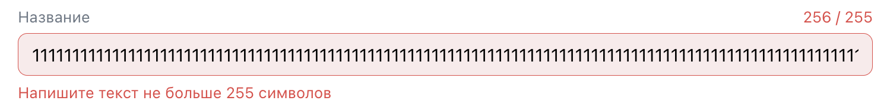

# Домашнее задание 3. Чек-листы на на проект ads.vk.com

## Команда: **SaraFun**

## Содержание

1. [Аудитории](#аудитории)
2. [Рекламные кампании](#рекламные-кампании)

## Аудитории

Ссылка: [https://ads.vk.com/hq/audience](https://ads.vk.com/hq/audience)

### Основная страница, тест-кейсы когда нет аудиторий

#### Если нет созданных аудиторий, то отображается сообщение "Аудиторий пока нет", кнопка "Создать аудиторию", кнопка меню, ссылка "Как работают аудитории"

1. Перейти на страницу https://ads.vk.com/hq/audience
2. Отображаются элементы: сообщение "Аудиторий пока нет", кнопка "Создать аудиторию", кнопка меню, ссылка "Как работают аудитории"

#### При нажатии на кнопку "Создать аудиторию" открывается окно создания аудитории

1. Перейти на страницу https://ads.vk.com/hq/audience
2. Нажать кнопку "Создать аудиторию"
3. Открывается окно создания аудитории

#### При нажатии на ссылку "Как работают аудитории" открывается новая вкладка со страницей https://ads.vk.com/help/features/audiences_lists/audiences

1. Перейти на страницу https://ads.vk.com/hq/audience
2. Нажать на ссылку "Как работают аудитории"
3. Открывается новая вкладка со страницей https://ads.vk.com/help/features/audiences_lists/audiences

#### При нажатии на кнопку меню открываются пункты меню "Активировать внешнюю аудиторию" и "Перенести аудитории из кабинета ВКонтакте"

1. Перейти на страницу https://ads.vk.com/hq/audience
2. Нажать на кнопку меню
3. Открываются пункты меню "Активировать внешнюю аудиторию" и "Перенести аудитории из кабинета ВКонтакте"

#### При нажатии на пункт меню "Активировать внешнюю аудиторию" открывается окно "Активировать внешнюю аудиторию"

1. Перейти на страницу https://ads.vk.com/hq/audience
2. Нажать на кнопку меню
3. Нажать на пункт меню "Активировать внешнюю аудиторию"
4. Открывается окно "Активировать внешнюю аудиторию"

#### При нажатии на пункт меню "Перенести аудитории из кабинета ВКонтакте" открывается окно "Копирование аудиторий"

1. Перейти на страницу https://ads.vk.com/hq/audience
2. Нажать на кнопку меню
3. Нажать на пункт меню "Перенести аудитории из кабинета ВКонтакте"
4. Открывается окно "Копирование аудиторий"

### Окно создания аудитории

#### При открытии окна создания аудитории оно содержит кнопку с иконкой крестика, кнопку "Добавить источник", кнопку "Исключить источник", кнопку "Сохранить", кнопку "Отмена", поле для ввода названия аудитории, ссылку "Как это работает"

1. Перейти на страницу https://ads.vk.com/hq/audience
2. Нажать кнопку "Создать аудиторию"
3. Открывается окно создания аудитории с соотвествующими элементами: кнопка с иконкой крестика, кнопка "Добавить источник", кнопка "Исключить источник", кнопка "Сохранить", кнопка "Отмена", поле для ввода названия аудитории, ссылка "Как это работает?"

#### Когда не было ничего изменено в окне создания аудитории при нажатии на кнопку с иконкой крестика окно создания аудитории закрывается

1. Перейти на страницу https://ads.vk.com/hq/audience
2. Нажать кнопку "Создать аудиторию"
3. Открывается окно создания аудитории
4. В открывшемся окне нажать кнопку с иконкой крестика
5. Окно создания аудитории закрывается

#### Когда были внесены изменения в окне создания аудитории при нажатии на кнопку с иконкой крестика открывается окно "Прервать создание?"

1. Перейти на страницу https://ads.vk.com/hq/audience
2. Нажать кнопку "Создать аудиторию"
3. Открывается окно создания аудитории
4. В открывшемся окне в поле для введения названия ввести строку "Тест"
5. Нажать кнопку с иконкой крестика
6. Открывается окно "Прервать создание?"

#### В окне создания аудитории при нажатии на ссылку "Как это работает?" открывается новая вкладка со страницей https://ads.vk.com/help/features/audiences_lists/audiences

1. Перейти на страницу https://ads.vk.com/hq/audience
2. Нажать кнопку "Создать аудиторию"
3. Открывается окно создания аудитории
4. В открывшемся окне нажать на ссылку "Как это работает?"
5. Открывается новая вкладка со страницей https://ads.vk.com/help/features/audiences_lists/audiences

#### В окне создания аудитории при нажатии на кнопку "Отмена" окно создания аудитории закрывается

1. Перейти на страницу https://ads.vk.com/hq/audience
2. Нажать кнопку "Создать аудиторию"
3. Открывается окно создания аудитории
4. В открывшемся окне нажать кнопку "Отмена"
5. Окно создания аудитории закрывается

#### В окне создания аудитории при нажатии на кнопку "Добавить источник" открывается окно "Добавить источник"

1. Перейти на страницу https://ads.vk.com/hq/audience
2. Нажать кнопку "Создать аудиторию"
3. Открывается окно создания аудитории
4. В открывшемся окне нажать кнопку "Добавить источник"
5. Открывается окно "Добавить источник"

#### В окне создания аудитории при нажатии на кнопку "Исключить источник" открывается окно "Исключить источник"

1. Перейти на страницу https://ads.vk.com/hq/audience
2. Нажать кнопку "Создать аудиторию"
3. Открывается окно создания аудитории
4. В открывшемся окне нажать кнопку "Исключить источник"
5. Открывается окно "Исключить источник"

#### При вводе названия аудитории длиной больше 255 символов показывается сообщение об ошибке

1. Перейти на страницу https://ads.vk.com/hq/audience
2. Нажать кнопку "Создать аудиторию"
3. Открывается окно создания аудитории
4. В открывшемся окне в поле ввода названия аудитории ввести строку "1111111111111111111111111111111111111111111111111111111111111111111111111111111111111111111111111111111111111111111111111111111111111111111111111111111111111111111111111111111111111111111111111111111111111111111111111111111111111111111111111111111111111111"
5. Поле ввода меняет цвет на красный и показывается сообщение "Напишите текст не больше 255 символов

#### При заполнении названия длиной менее 256 символов, добавлении хотя бы 1 аудитории или исключении хотя бы 1 аудитории при нажатии на кнопку "Сохранить" аудитория сохраняется

1. Перейти на страницу https://ads.vk.com/hq/audience
2. Нажать кнопку "Создать аудиторию"
3. Открывается окно создания аудитории
4. В открывшемся окне в поле ввода названия написать строку "Тест"
5. В открывшемся окне нажать кнопку "Добавить источник"
6. В открывшемся окне "Добавить аудиторию" нажать на пункт "Вводили ключевые фразы"
7. В открывшемся окне "Вводили ключевые фразы" в поле для ввода ключевых фраз написать строку "фраза"
8. В окне "Вводили ключевые фразы" нажать кнопку "Сохранить"
9. В окне создания аудитории нажать кнопку "Сохранить"
10. Окно создания аудитории закрывается, на вкладке "Аудитории" отображается аудитория с названием "Тест"

## Рекламные кампании

Ссылка: [https://ads.vk.com/hq/dashboard](https://ads.vk.com/hq/dashboard)
